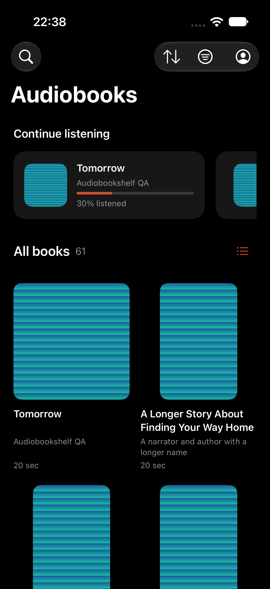

# Apple book progress and catalog layout

## CURRENT (2026-10-02)

Client source `d3152a5d3bc0eb7c23bf77e835088d650df514a3` includes merged localization PR #121.
All five affected native cases passed once on the unchanged `cd703e87` packaged server, including offline
finish publication and migration idempotence. Evidence and separate owner/hardware gates are recorded in [Apple packaged-server QA](APPLE-REAL-SERVER-QA.md#current-2026-10-02).
Historical failures below remain evidence for their original source and server, not the current image.

This is an incremental native preview slice, not Apple readiness or completed preference parity.

## Book completion

Book details can mark a book finished or unfinished using the existing server progress API. Changing existing saved audio/reader progress or live audio progress requires confirmation. Cancel preserves playback. Matching playback closes and flushes its session before applying the mutation, and canonical account guards prevent publishing responses after switching accounts. Returned progress is retained in the listening journal and catalog.

The continuing shelf removes completed entries. Progress-filtered shelves refetch their first page when returning from details, updating membership and totals without dismissing the active detail screen during its request. Pagination invalidation prevents an older in-flight page from overwriting the new state.

New production UI journeys genuinely failed before implementation: book actions were absent, live playback with no saved progress bypassed confirmation, and a finished book remained in the Not finished filter. After correction, the journeys passed on both phone and tablet, observing actual WAV playback, server PATCH requests, cancellation, filtered membership and relaunch persistence.

## Cover alignment

Loaded artwork is constrained by a square outer layout; the image fits inside that surface without cropping or changing its preferred size. Compact details use centered artwork and metadata; regular-width details retain a leading horizontal layout. The catalog removes the decorative introduction and uses smaller metadata.

Grid rows align at their top. Title and author labels reserve two lines using their native font metrics, so short titles and authors do not stagger artwork or durations. The hidden sizing labels are excluded from accessibility, scale with the native font and do not affect compact list rows.

A new loaded-artwork journey first observed horizontal overflow and overlap, then passed after bounding the surface. An extended fixture with unequal metadata lengths reproduced an 18-point vertical stagger before top alignment and reserved metadata were implemented. The final alignment journey passed on iPhone and iPad. The rendered Black catalog was visually inspected.

## Verification and limits

- The nine-case iPhone artwork/preferences/podcast regression selection passed before the final row alignment change. The affected alignment journey passed afterward.
- All four final iPad artwork and book-completion journeys passed. An earlier tablet run stalled at its simulator keyboard; it was interrupted and retried on the dedicated QA simulator.
- Minimum-iOS-14 source typechecking passed after the final alignment change. Shared core (15 cases), Python fixture/compatibility (8 cases), and a TV simulator build passed for the book-progress slice.
- Local signed build and strict app/IPA verification passed. The final preview was installed on the physical iPhone and iPad. Installation is not physical interaction acceptance.

Simulator runtime was iOS 27. Xcode's build-only deployment override remains 15.0; older-runtime acceptance is still outstanding. Live server, physical playback/system controls, migration and broader preference/progress parity remain under the current Apple tickets.

