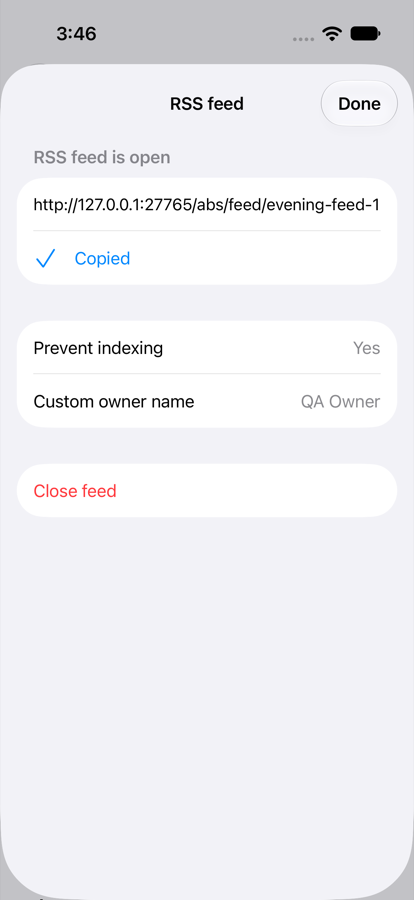
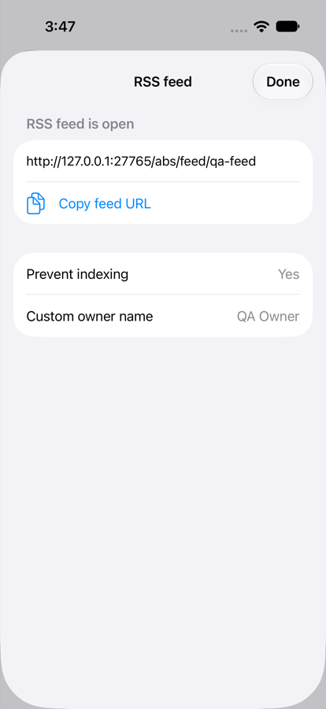
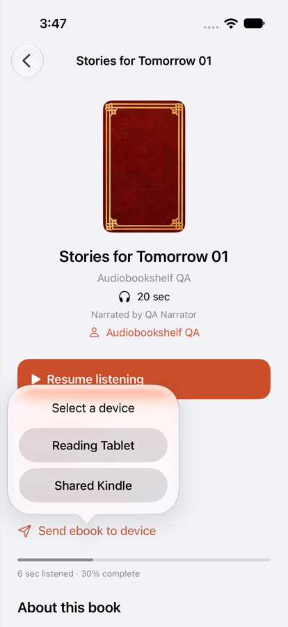

# iPhone and iPad item server actions: RSS feed and send ebook to device

These are the two baseline item actions the native app lacked. Both come from `components/modals/ItemMoreMenuModal.vue`:

- the RSS feed entry (lines 108 and 254), backed by `components/modals/rssfeeds/RssFeedModal.vue`;
- Send ebook to device (lines 89 and 464).

Branch `feat/item-server-actions`, based on `fork/apple-final-integration` (`ca45d769`). The work is in new files only:

- Core API adapters and a store in `tvos/Core`;
- a SwiftUI module, `apple/App/ItemServerActionsViews.swift`;
- a synthetic fixture and journeys.

BookDetails and localization are root-owned and are wired through the patch below.

## Server contract (Audiobookshelf 2.30 source)

No endpoint was invented, and no backend change is needed.

| Need | Route | Permission (server) | Source |
| --- | --- | --- | --- |
| User type and e-reader devices | `POST /api/authorize`. It returns `user` and `ereaderDevices`, the same payload as sign-in | Any signed-in user. Devices are filtered by `availabilityOption` (`adminOrUp`, `userOrUp`, `guestOrUp`, `specificUsers`) | `MiscController.authorize`, `Auth.getUserLoginResponsePayload`, `EmailSettings.getEReaderDevices` / `checkUserCanAccessDevice` |
| The item's open feed | `GET /api/items/:id?expanded=1&include=rssfeed`. It returns `rssFeed`, as `Feed.toOldJSONMinified()` or `null` | Item access | `LibraryItemController.findOne` |
| Open a feed | `POST /api/feeds/item/:id/open` with `{serverAddress, slug, metadataDetails: {preventIndexing, ownerName, ownerEmail}}`. It returns `{feed}` | Admin or root. Anyone else gets 403 from `RSSFeedController.middleware` | `RSSFeedController.openRSSFeedForItem`, `RssFeedManager.getFeedOptionsFromReqOptions` |
| Close a feed | `POST /api/feeds/:feedId/close`. It returns 200 `OK` | Admin or root (403) | `RSSFeedController.closeRSSFeed` |
| Send the ebook | `POST /api/emails/send-ebook-to-device` with `{libraryItemId, deviceName}`. It returns 200 `OK` | Device access (403), item access (403), and the item must have an `ebookFile` (404) | `EmailController.sendEBookToDevice`, `EmailManager.sendEBookToDevice` |

**Open feed errors.** 400 `Invalid request body`, 400 `Item has no audio tracks`, 400 `Slug already in use`, 404 when the item is missing.

**Send errors.**
- 404 `Ereader device not found`, `Library item not found` or `Ebook file not found`.
- 400 when the e-mail fails. The send is a 400 `Failed to send ebook to device`; an SMTP configuration failure is a 400 `Failed to verify SMTP connection configuration`.

**Feed address.** `feedUrl` is a server path, `/feed/<slug>`. The baseline shows `serverAddress + feedUrl`, and so does the app.

## Permissions, as in the baseline

**RSS feed action** (`showRSSFeedOption`):
- It needs a server item.
- It is shown when the item has an open feed (to anyone), or to an admin or root user when the item has tracks or episodes.
- Without an open feed, other users see nothing.
- Open feed and Close feed are offered only to admins, which mirrors the server's admin-only feed routes. A user who can only view gets the address, Copy, Prevent indexing and the owner fields.

**Send ebook to device** (`ereaderDeviceItems`):
- Books only.
- It needs an `ebookFile` and at least one device in the user's own `ereaderDevices`.
- The device sheet lists exactly those devices. A device name that is not in that list is never sent.
- Supplementary ebooks are not sendable: the server sends `media.ebookFile` only.

**Capability fallback.**
- If `ereaderDevices` is missing from the authorize payload, there are no devices and no send action.
- If `rssFeed` is missing from the item, there is no open feed, so only admins see Open RSS feed.
- If loading fails, the section shows `RecoveryCard` with Try again.
- Action failures show a message by status:
  - 403: not allowed;
  - 404: not found;
  - 400: refused, which covers a slug in use and a failed e-mail;
  - otherwise the connection recovery text.

**Slug.**
- The slug starts as the item id, like the baseline `init()`.
- `ItemServerActions.sanitizedSlug` is the baseline `$sanitizeSlug` (`plugins/init.client.js`), quirks included: only the first dot becomes a dash, and the range ` -_` keeps ASCII from space to underscore.
- As in the baseline, an unsanitized slug is corrected in the field and not sent, so the admin confirms by opening again.
- The app warns, as the baseline notes do, for an `http://` server address and for podcast episodes without `pubDate`.

## Account and sign-in ownership

`ItemServerActions` reuses the related pages' `OpenedSignIn`:

- It records `authorizationRevision` when the store is created and the `AccountIdentity` on first load.
- Every request (authorize, item, open, close, send) carries that revision, so none is sent after a sign-in change, including A→B→A.
- Results and errors are published only while the revision and account are unchanged.
- `POST /api/authorize` must also name the pinned account's user id (`OpenedSignIn.owns(userID:)`), otherwise nothing is shown.
- A response that arrives after a sign-in change is dropped by `APIClient.request` itself, and the store checks again before applying it.

## Shared Core additions (`tvos/Core/Sources/TVCore`)

- `APIClient.swift`, all pinned with `authorization: UUID`:
  - `sessionAuthorization(authorization:)`;
  - `itemActions(id:authorization:)`;
  - `openFeed(itemID:serverAddress:slug:preventIndexing:ownerName:ownerEmail:authorization:)`;
  - `closeFeed(id:authorization:)`;
  - `sendEbookToDevice(itemID:deviceName:authorization:)`.
- `ItemServerActions.swift` (new):
  - The models: `RSSFeed`, `EReaderDevice` (name only; the device's e-mail address is not decoded), `SessionAuthorization`, `ItemActionsDetail` and `ItemServerActionError`.
  - The `@MainActor` store `ItemServerActions`, with `load`, `openFeed`, `closeFeed`, `send(to:)`, `showsFeed`, `canManageFeed`, `canSendEbook`, `hasEpisodesWithoutPubDate`, `feedURL(_:)`, `activity`, `sent` and `error`.
- `AuthorSeries.swift`: `OpenedSignIn.owns(userID:)`.
- The TV project lists Core files explicitly and does not include the new file. The TV app gets no item actions; it has no ebook or admin parity to add. `tvos/project.yml` includes the whole directory, and the file only needs Foundation and Combine.

## iPhone and iPad UI (`apple/App/ItemServerActionsViews.swift`, new, iOS 14 compatible)

- **`ItemServerActionsSection(itemID:catalog:)`** shows two separate actions:
  - `item-rss-feed`, labelled "RSS feed" or "Open RSS feed";
  - `send-ebook`, "Send ebook to device", which opens an action sheet titled "Select a device".
  - Progress and result use `send-ebook-result` ("Ebook sent to {0}"); errors use `item-action-error`.
- **`RSSFeedSheet`.**
  - Open feed: `rss-feed-url`, `rss-copy` (Copied), `rss-prevent-indexing`, `rss-owner-name`, `rss-owner-email`, and `rss-close` for admins.
  - New feed (admins): `rss-slug`, the feed URL preview, the prevent-indexing toggle (on by default), owner name and email, the warnings, and `rss-open`.
  - Closing dismisses the sheet, like the baseline.
- **Realtime.** The baseline item page also follows the `rss_feed_open` and `rss_feed_closed` socket events. The native store reloads when details appear; it does not subscribe to `NativeRealtime`, which is root-owned. If root wants live updates, call `actions.load()` on those events for the same item.

## Integration for root

**Wiring.** Apply [`apple-item-server-actions-wiring.patch`](apple-item-server-actions-wiring.patch) against `ca45d769`. It adds one line to `BookDetails`, after Download for offline:

```swift
if episode == nil { ItemServerActionsSection(itemID: book.id, catalog: catalog) }
```

That covers book and podcast details, not episode details: episodes have no ebook, and the feed belongs to the item. `xcodegen` picks up the new view file from `App`.

**Localization.** Run `python3 apple/Localization/generate.py` after applying, and add these legacy equivalents to `apple/Localization/legacy-equivalents.json`. The meaning matches the legacy keys; the other new texts have none.

```json
"Send ebook to device": "ButtonSendEbookToDevice",
"RSS feed": "HeaderRSSFeed",
"Open RSS feed": "HeaderOpenRSSFeed",
"RSS feed is open": "HeaderRSSFeedIsOpen",
"Prevent indexing": "LabelRSSFeedPreventIndexing",
"Custom owner name": "LabelRSSFeedCustomOwnerName",
"Custom owner email": "LabelRSSFeedCustomOwnerEmail",
"Feed slug": "LabelRSSFeedSlug",
"The feed URL will be {0}": "MessageFeedURLWillBe",
"Close feed": "ButtonCloseFeed",
"Open feed": "ButtonOpenFeed",
"Select a device": "LabelSelectADevice",
"Important: most podcast apps require the RSS feed URL to use HTTPS.": "NoteRSSFeedPodcastAppsHttps",
"Important: one or more of your episodes do not have a Pub Date. Some podcast apps require this.": "NoteRSSFeedPodcastAppsPubDate"
```

Skip any of these that `legacy-equivalents.json` already maps; for example, `Yes`, `No` and `Cancel` may already be there.

**Integrated suite.** Once wired, `ItemServerActionsJourney` can join the integrated mobile suite:
- drop its `ABS_ITEM_ACTIONS_QA` skip;
- serve `apple/scripts/item_actions_fixture.py` (it wraps the related fixture);
- the journey URL is port 27765.

## Verification (synthetic data only)

`apple/scripts/item_actions_fixture.py` adds the routes above to `tvos/scripts/related_fixture.py`, with the server's checks in the server's order:

- admin-only feed routes;
- body, audio and slug validation;
- device access by `availabilityOption`, then item, then ebook.

Its synthetic data:
- Feeds live in memory. A successful send is only recorded; no e-mail is sent.
- Devices: Reading Tablet (`userOrUp`), Admin Reader (`adminOrUp`), Shared Kindle (`specificUsers`, the QA user) and Other Kindle (`specificUsers`, someone else). The addresses use `example.invalid`.

Control routes:
- `POST /__actions__/configure {role, feed, ebook, fail: "open"|"close"|"send"}`;
- `GET /__actions__/observations`.

| Check | Command | Result |
| --- | --- | --- |
| Core contracts | `swift test --package-path tvos/Core` | 63 passed, including 15 in `ItemServerActionsTests` |
| Fixture follows the server checks | `python3 -m unittest apple/scripts/test_item_actions_fixture.py` | 4 passed |
| Journeys, app as it is | `./apple/scripts/verify-item-actions.sh --as-is` (port 27765, simulator "Audiobookshelf RelatedQA") | 4 of 4 fail (expected): details have no `item-rss-feed` or `send-ebook` |
| Journeys with the wiring | `./apple/scripts/verify-item-actions.sh` (applies and reverts the patch) | 4 of 4 pass |

**Tests observed failing first.**

- **Core, against compiling stubs.** `ItemServerActionsTests` failed 12 of 14 tests with 31 assertion failures, on October 2, 2026.
- **The two that passed against the stub** are guards.
  - `testAnAuthorizationForAnotherUserIsNotShown` fails (3 assertions) when the user id check is removed.
  - `testASignInChangeDuringAnActionDropsItsResult` still passes when the store's check after the request is removed, because `APIClient.request` already drops a response whose sign-in changed in flight. The test protects the outcome, not that particular line.
- **The pub date warning test** was added later, and failed first against a constant `false`.
- **Journeys.** They failed 4 of 4 on the app as it is.

The journeys cover:

1. An admin opens a feed. The slug "Evening.Feed 1" is corrected to `evening-feed-1` without a request. The admin opens it with an owner name, sees and copies the URL, checks the exact request body, and closes the feed.
2. A user views an open feed without Close or Open, sees no feed action on an item without one, and sends no feed request.
3. A user sends to Shared Kindle. Admin Reader and Other Kindle are not listed. The fixture records exactly `{libraryItemId, deviceName}`.
4. A failed send is reported, and sending again succeeds.

Screenshots (synthetic fixture):

  

## Not verified here

- **Real server.** Opening or closing a real feed, and sending a real e-mail through configured SMTP and e-reader devices, were deliberately not done against the owner's server. They need an owner-approved test item and device.
- **iPad.** iPad layout of the section and the device action sheet was not run separately. The journeys ran on iPhone 17 Pro, iOS 27.
- **Collection and series feeds.** The server also has `POST /api/feeds/collection/:id/open` and `/series/:id/open`, but the baseline item menu does not offer them, so they are not added.
