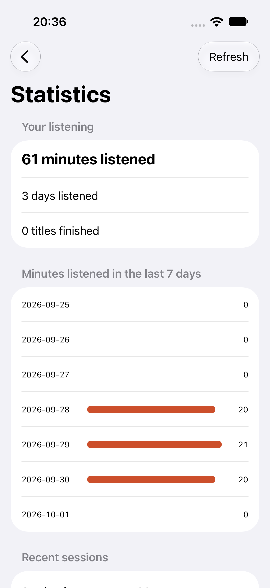
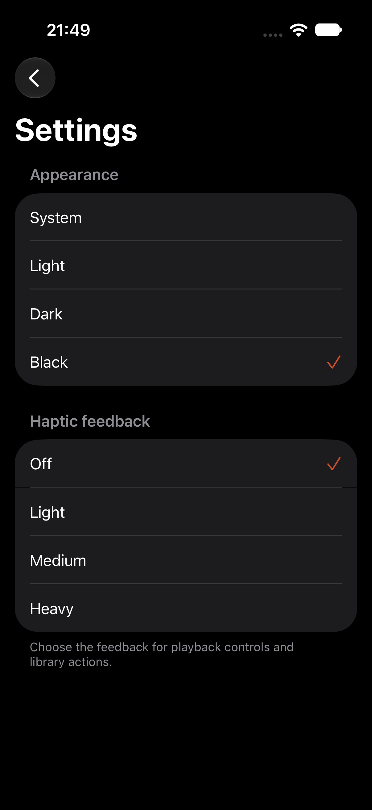
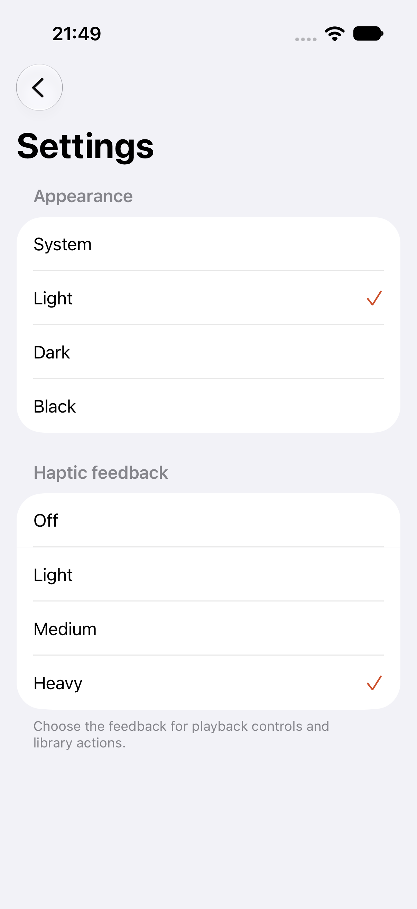

# Apple display preferences and statistics

This is an incremental part of #22, not complete preference parity. The native catalog retains its selected list/cover layout through relaunch and across libraries. The preference belongs to the device; it does not change account permissions or saved library selection.

Statistics uses the existing `/api/me/listening-stats` endpoint and current-user progress. It shows total listening minutes, distinct listening days, completed titles, the last seven daily totals including empty days, and recent sessions. Recent sessions retain server order and millisecond timestamps. The screen clears old data while reloading and publishes responses only for the request generation and canonical account that initiated them. Errors expose retry without retaining credentials in presentation.

The 2.30 server normalizes aggregate totals but permits numeric strings in raw session durations. The native decoder accepts both numeric forms. Invalid textual durations remain decoding failures rather than being silently represented as zero.

## Local verification

Run `bash apple/scripts/verify-ui.sh -only-testing:NativeJourneyTests/PreferencesJourney` against the signed native app and synthetic loopback server. Use `ABS_QA_SIMULATOR='Audiobookshelf Native iPad QA'` for the tablet.

The display journey first failed because relaunch forgot the list choice. The statistics journey first failed because its navigation action was missing. After implementation, both journeys passed on iPhone and iPad with numeric durations. A later numeric-string fixture caused the real screen to fail loading; the decoder correction passed the selected iPad statistics journey. One tablet run was interrupted at a stalled simulator keyboard after its layout case passed, then recovered by restarting only the dedicated QA device. These simulator issues are not classified as product failures.

The current slice passed minimum-iOS-14 source typechecking, the shared core suite, fixture/compatibility checks, a TV simulator build and strict local signing/packaging. The final two-case iPhone run passed with the numeric-string fixture. The signed internal preview was installed on both physical devices; installation does not establish live or physical interaction acceptance. The captured iPhone statistics screen was visually inspected.

## Native appearance and haptics

The account menu now opens native Settings. Appearance includes System, Light, Dark and Black, preserving the three baseline theme choices and adding automatic system appearance. Haptic feedback includes Off, Light, Medium and Heavy. Both choices persist through relaunch. Appearance travels through a shared environment outside the root's sheet modifiers, so modal content inherits it. Lists and forms share the same guarded surface treatment; the iOS 14 table background is transparent, and iOS 16+ hides the native scroll background. Catalog/detail/player surfaces and cards consume the selected palette.

Explicit feedback samples the chosen strength when changing settings and at instrumented playback, progress and feed queue actions. Off avoids creating the impact generator. Simulator preference checks do not prove physical vibration or all baseline action coverage.

A new three-launch production UI journey first failed because Settings was absent. After implementation it passed on iPhone, preserving Black/Off and then Light/Heavy. The full three-case preference suite passed on iPhone. On iPad, layout and statistics passed before its keyboard stalled during the new case; restarting only the dedicated QA simulator let the selected case pass against the latest shared form treatment. Minimum iOS 14 source typechecking and strict local signing/packaging passed. Actual Black and Light settings screenshots were visually inspected. The latest native form treatment passed the server bookmark create/edit/jump/delete journey and actual short-timer stopping after leaving playback. The signed preview was installed on both physical devices; installation alone does not establish interaction or vibration acceptance.

## Remaining work

Full theme/modal/large-text acceptance, localization, remaining haptic action coverage and physical vibration, applicable network policy options, statistics year-in-review, history and permitted progress management, preference migration, full accessibility/localization acceptance, and live/device acceptance remain under their current Apple tickets. iOS orientation locking is absent from the baseline settings presentation; the source inventory's stored key must still be preserved during migration. This slice does not close #22.
