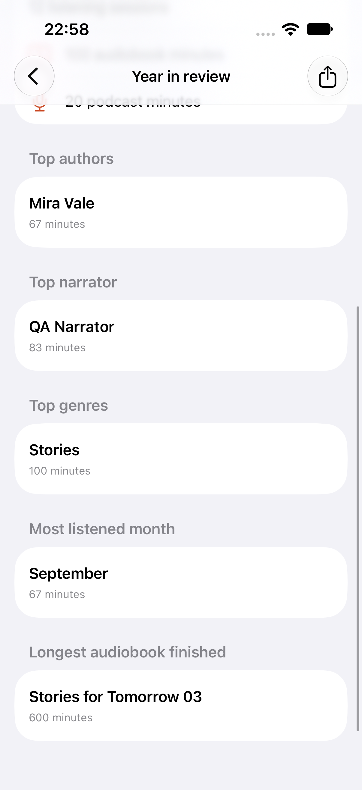
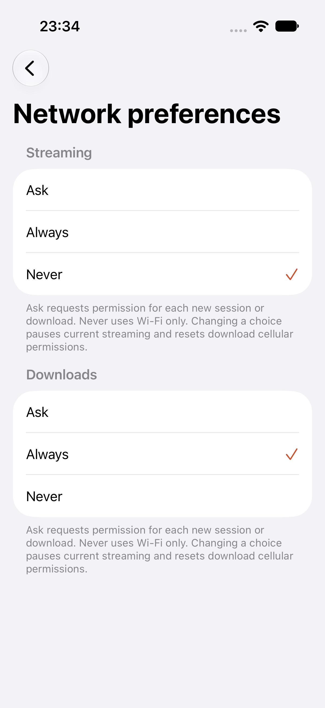

# Apple display preferences and statistics

This is an incremental part of #22, not complete preference parity. The native catalog retains its selected list/cover layout through relaunch and across libraries. The preference belongs to the device; it does not change account permissions or saved library selection.

Statistics uses the existing `/api/me/listening-stats` endpoint and current-user progress. It shows total listening minutes, distinct listening days, completed titles, the last seven daily totals including empty days, and recent sessions. Recent sessions retain server order and millisecond timestamps. The screen clears old data while reloading and publishes responses only for the request generation and canonical account that initiated them. Errors expose retry without retaining credentials in presentation.

The 2.30 server normalizes aggregate totals but permits numeric strings in raw session durations. The native decoder accepts both numeric forms. Invalid textual durations remain decoding failures rather than being silently represented as zero.

## Local verification

Run `bash apple/scripts/verify-ui.sh -only-testing:NativeJourneyTests/PreferencesJourney` against the signed native app and synthetic loopback server. Use `ABS_QA_SIMULATOR='Audiobookshelf Native iPad QA'` for the tablet.

The display journey first failed because relaunch forgot the list choice. The statistics journey first failed because its navigation action was missing. After implementation, both journeys passed on iPhone and iPad with numeric durations. A later numeric-string fixture caused the real screen to fail loading; the decoder correction passed the selected iPad statistics journey. One tablet run was interrupted at a stalled simulator keyboard after its layout case passed, then recovered by restarting only the dedicated QA device. These simulator issues are not classified as product failures.

The current slice passed minimum-iOS-14 source typechecking, the shared core suite, fixture/compatibility checks, a TV simulator build and strict local signing/packaging. The final two-case iPhone run passed with the numeric-string fixture. The signed internal preview was installed on both physical devices; installation does not establish live or physical interaction acceptance. The captured iPhone statistics screen was visually inspected.

## Native appearance and haptics

The account menu now opens native Settings. Appearance includes System, Light, Dark and Black, preserving the three baseline theme choices and adding automatic system appearance. Haptic feedback includes Off, Light, Medium and Heavy. Both choices persist through relaunch. Appearance travels through a shared environment outside the root's sheet modifiers, so modal content inherits it. Lists and forms share the same guarded surface treatment; the iOS 14 table background is transparent, and iOS 16+ hides the native scroll background. Catalog/detail/player surfaces and cards consume the selected palette.

Explicit feedback samples the chosen strength when changing settings and at instrumented playback, progress and feed queue actions. Off avoids creating the impact generator. Simulator preference checks do not prove physical vibration or all baseline action coverage.

A new three-launch production UI journey first failed because Settings was absent. After implementation it passed on iPhone, preserving Black/Off and then Light/Heavy. The full three-case preference suite passed on iPhone. On iPad, layout and statistics passed before its keyboard stalled during the new case; restarting only the dedicated QA simulator let the selected case pass against the latest shared form treatment. Minimum iOS 14 source typechecking and strict local signing/packaging passed. Actual Black and Light settings screenshots were visually inspected. The latest native form treatment passed the server bookmark create/edit/jump/delete journey and actual short-timer stopping after leaving playback. The signed preview was installed on both physical devices; installation alone does not establish interaction or vibration acceptance.

## Annual listening statistics

Statistics now opens a native Year in review against the existing `/api/me/stats/year/:year` endpoint. It shows listening minutes, finished/listened books, session count, audiobook/podcast time, leading authors/genres/narrator, most listened month and the longest finished audiobook. Previous/next year navigation clears old results while loading; request-generation and canonical-account checks guard publication. A native share action offers a text summary. Image-card variants, permitted server-wide annual review and physical sharing acceptance remain outstanding.

The field names and seconds-based totals were checked against the installed 2.30 server's query source, not against private production data. Protocol years and zero-based month indexes remain Gregorian even when the device uses another calendar; names retain the locale.

A new production UI journey genuinely failed because Year in review was absent, then passed with synthetic annual totals and a different previous-year response. Review identified a device-calendar defect: a Buddhist-locale production launch genuinely requested the wrong year and failed its totals/route assertions before the Gregorian correction. Both that case and the existing statistics journey passed afterward. The latter now scrolls to its recent session after the added navigation row shifted it below the viewport. The prior eight-case phone selection passed seven cases and failed only that offscreen assertion. All three final affected iPad statistics/annual/calendar journeys passed.

Minimum-iOS-14 source typing, the 15-case shared core suite and eight Python fixture/compatibility checks passed. The TV simulator target and strict local signed app/IPA packaging also passed after the shared API addition. The captured annual screen was visually inspected. Synthetic journeys do not establish complete annual parity or live/physical acceptance.

## Remaining work

Full theme/modal/large-text acceptance, localization, remaining haptic action coverage and physical vibration, physical cellular/transition acceptance, annual image/server-wide review, applicable diagnostics and permitted progress management, preference migration, full accessibility/localization acceptance, and live/device acceptance remain under their current Apple tickets. iOS orientation locking is absent from the baseline settings presentation; the source inventory's stored key must still be preserved during migration. This slice does not close #22.

## Streaming and download network choices

Network preferences offers independent Ask, Always and Never choices for streaming and downloads. The existing preview download-cellular boolean is retained as the initial download choice; streaming retains its previous Always default. Ask requests explicit cellular permission for each new listening session or download, including a later Wi-Fi disconnect. Wi-Fi only still starts the operation with cellular access disabled. Streaming uses `AVURLAssetAllowsCellularAccessKey`; download requests use `allowsCellularAccess`. Offline file playback does not ask or depend on these choices.

A streaming permission lasts for the current session and its track changes. Changing the streaming choice pauses and unloads remote audio; resuming rebuilds the asset under the new choice at the saved position. Download consent is account/item scoped in the existing durable manifest and survives relaunch. Changing the download choice cancels previous transfers, rotates their generations and clears grants before recreating requests. Manifest failures block pumping after cancellation. Startup reconciles saved policy and retained background-task permissions before attaching tasks, so a crash around a settings change cannot silently restore an earlier cellular request. Finished local parts remain available.

The three-launch production settings journey first failed because Network preferences was absent, then passed with independent persisted choices. Review found and corrected cancellation-before-save, queued consent replacement, token-refresh reentrancy, and background task restoration gaps. Simulator UI and synthetic audio/download fixtures do not prove radio switching, actual metered transfer, background daemon behavior under device storage failure, or physical consent interactions. Those device gates remain open under #15, #16 and #22.

The first phone regression selection passed all 11 journeys (eight playback, two offline and the new settings case). After the final startup restoration corrections, the three affected iPad journeys passed, followed by a final two-case phone settings/offline selection. Minimum-iOS-14 source typechecking, the shared TV simulator build and strict local signed packaging passed. The captured settings screen was inspected. The signed build was installed on both physical devices. The first iPad install disconnected in CoreDevice; the retry succeeded. Installation alone does not establish radio/physical acceptance.

