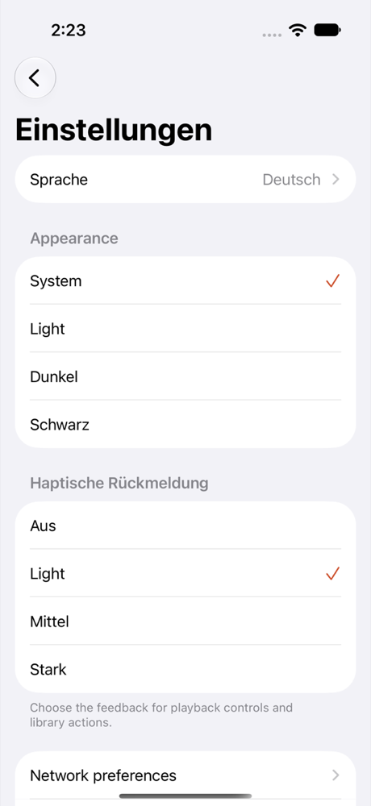
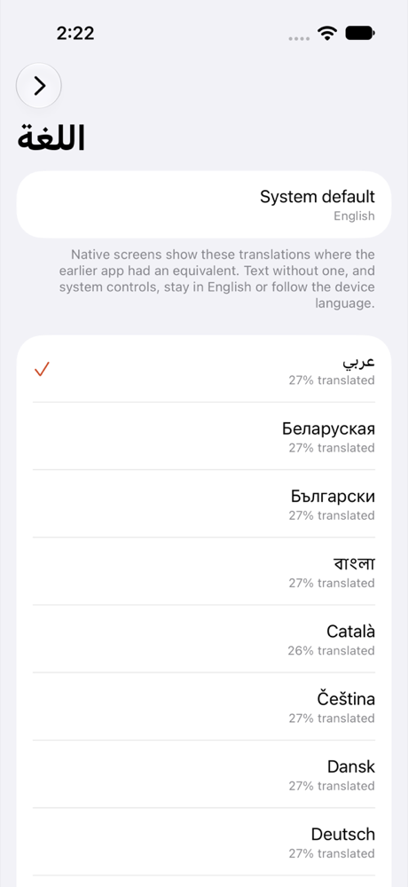
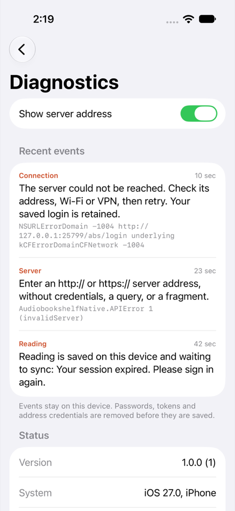
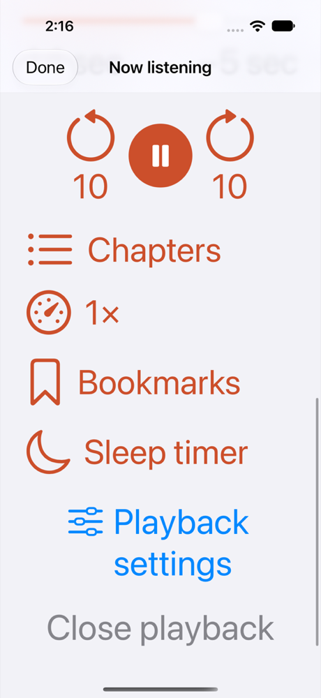
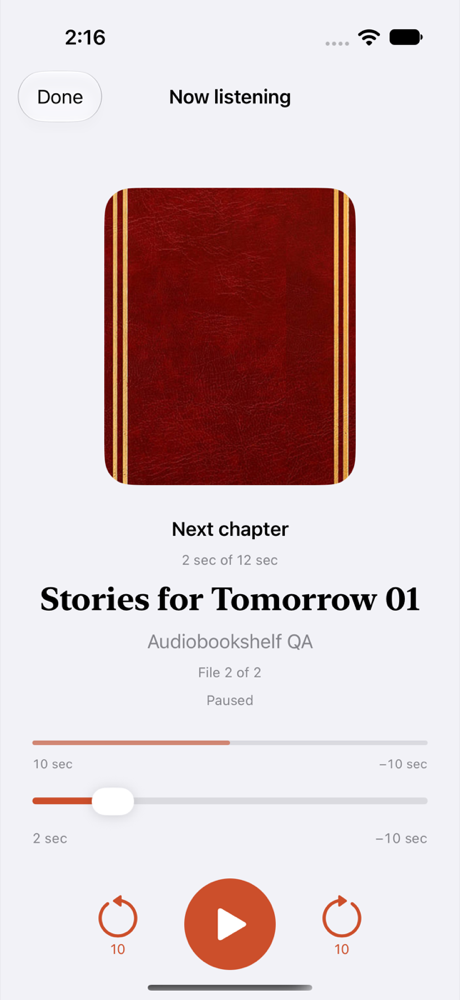
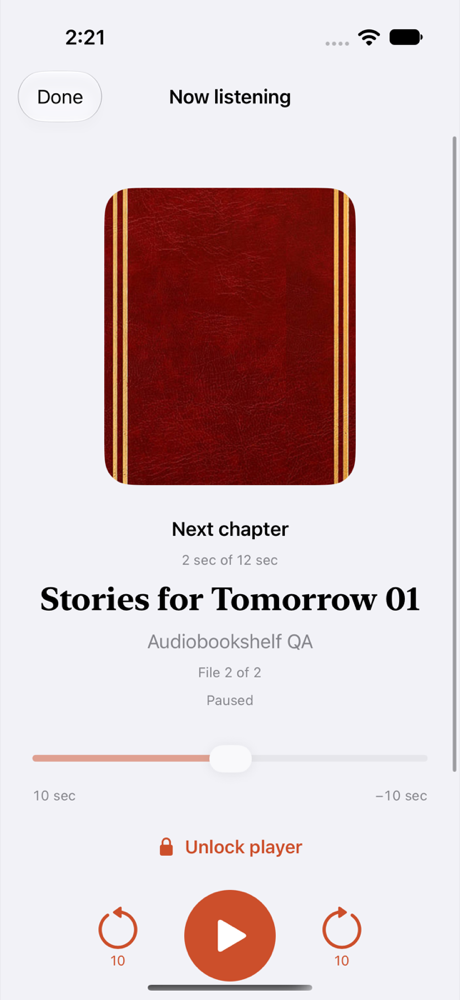

# Apple language, diagnostics, haptics, accessibility and player display

Part of #22. This slice adds native language selection, credential-safe diagnostics, the remaining haptic actions, large-text
layout and the legacy player display preferences. Root-owned files (app root, connection screens, Year in review, migration,
project) are not edited; `apple/Localization/HANDOFF.md` and `handoff/root-views.patch` describe their integration.

## Language

Settings → Language offers System default and all 30 languages the legacy app offered (`plugins/i18n.js`), in legacy order.
The choice is saved as the legacy code under `previewLanguage`; without one, the first supported device language applies,
then English. A change applies to open screens without relaunch, and Arabic and Hebrew mirror the layout.

Native text is keyed by its English wording. A language shows a translation only where `legacy-equivalents.json` names a
legacy key with the same meaning and that language's legacy file has a usable value (non-empty, no markup, same
placeholders). Native screens show 358 distinct texts and 98 have such a key, so each language is between 18% (`lt`) and
27% translated (`COVERAGE.md`). The rest stays English, and the Language screen shows each language's share and says so.
System controls follow the device language. Dates and durations use the chosen locale.

Migration keeps any supported legacy `languageCode`, `en-us` included, only when no native choice exists. The legacy app
always showed the saved code's language, whatever the device language, so adopting it preserves what the person saw. The
server default language that the legacy app applied on first connection is not applied separately.

## Diagnostics

Account menu → Diagnostics (and, after the root patch, the connection screen) lists recent failures first, then status:
version, system, language, server, connection, network preferences, playback, listening waiting to sync and downloads.
Events come from failures the screens already show: connection and server recovery messages, playback and progress sync,
bookmarks, downloads, reading and saved connections. They are stored on the device (at most 200, repeats coalesced).

Credentials are removed before an event is saved: URL user info, query values and fragments, JWTs, Bearer and Basic values,
whole Cookie and Set-Cookie values, and values of token, password, secret, API key, authorization and code verifier fields,
including prefixed names and quoted or `Optional("…")` values. Quoted values run to their real closing quote, past escaped
quotes; an unclosed quote runs to the end of its line. Swift errors are described by domain, code and case name,
never their associated values. Server addresses are masked on screen and in the report until Show server address is turned
on. The report, with English labels for maintainers, leaves the device only through Share or Copy, which the person starts.

## Haptics

The chosen strength (Off, Light, Medium, Heavy) now also covers skip, scrub, chapter, sleep timer, bookmark, sort, filter,
layout, library, download, podcast, lock and log actions. Off creates no generator. Simulator journeys observe the
requested action and strength through a DEBUG-only probe; they do not prove physical vibration.

## Large text and reduced motion

At accessibility text sizes the player gives each control its own row, so labels no longer break mid-word, and the skip row,
statistics day rows and continue-listening cards adapt. The native screens use system transitions only, with no custom
animation, so Reduce Motion is handled by the system. No separate reduced-motion journey was run.

## Player display

Playback settings now include the legacy player menu choices (`components/app/AudioPlayer.vue`):

- Chapter track (`previewChapterTrack`, owned by `ApplePlayback`) makes the slider and times cover the current chapter.
- Total track (`previewTotalTrack`, default on) shows the whole book above it. Turning one track off turns the other on.
- Scale elapsed time by speed (`previewScaleElapsedBySpeed`, default on). Remaining time is always divided by speed.
- Lock player (`previewLockPlayerControls`, default off) disables scrubbing, skips, chapters, bookmarks and Close playback,
  and shows Unlock. Play, pause, speed, sleep timer, Done and settings stay available. Like the legacy in-app lock, it does
  not change system media controls.

## Not applicable on iOS

Event history is disabled on iOS in the legacy app, and the legacy iOS app has no orientation lock setting. Neither is
reproduced. The legacy year review canvases draw English only, so there are no translations to reuse for year export.

## Verification

All on the dedicated Audiobookshelf Presentation QA simulator with fixtures on 25765/25769 (`apple/scripts/verify-presentation.sh`).

- RED first. The nine presentation journeys (`73a6807c`) all failed on the previous app because the feature was missing:
  no Language or Diagnostics entry, no haptic observation, player labels broken across lines (Chapters measured 69×211 pt).
  An earlier large-text assertion that only checked clipping passed on the old app; it was replaced before the RED run.
  After that run, test mechanics changed (scrolling lazy lists, a fresh Add server form, tapping the inner switch, opening
  the first book from Continue listening after sorting); the behaviour asserted did not change. The three player journeys
  (`dfa76009`) failed because the settings were missing. The redaction regressions reproduced each leak found in review
  before its fix: the second cookie, `Optional("…")` contents, prefixed keys and copied error payloads (`2e472ef5`), the
  rest of a value after an escaped quote, exactly `{"password":"[redacted]"synthetic-tail"}` (`8dec7e90`), and an
  unterminated quoted value (`cae46e59`).
- GREEN. One run of all 12 journeys passed on iOS 27 (iPhone) at `a005d888`; the three diagnostics journeys passed again
  with the final redactor (`b5e7e9f6`), which changed no app code. Localization 13 of 13 and Diagnostics 20 of 20 package
  tests pass, and `generate.py --check` is clean.
- The app sources, with the Localization and Diagnostics packages, typecheck for iOS 14 on device and simulator targets
  with no errors or warnings, with and without the root patch applied. Builds and tests used the build-only
  `IPHONEOS_DEPLOYMENT_TARGET=15.0` override that Xcode 27 requires.

Not established: iPad, iOS 14 runtime, physical vibration, VoiceOver walkthroughs, physical device acceptance, and the root
integration (project registration, app root, connection screen, migration mapping, year export copy).

