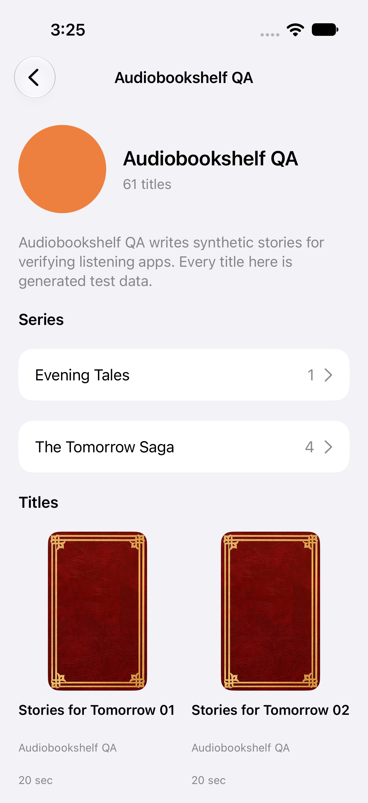
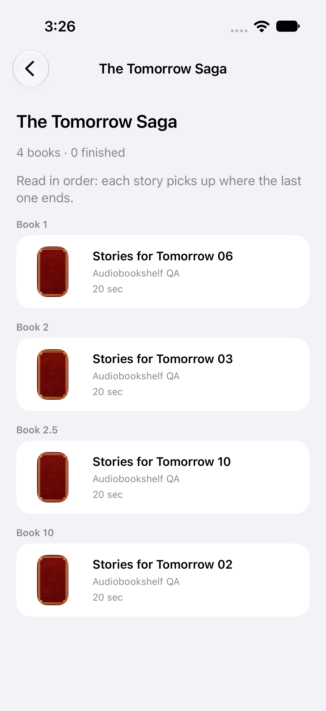

# Apple related authors and series (story #21)

Scope: `story-21`, "As a listener following an author or series, I want its related items and metadata, so that I can choose what to listen to next." This covers Apple TV and the iPhone/iPad client. It closes two audit findings:

- Mobile `LibrarySearch` opened a generic `CatalogShelf`, in title order, for an author or series. It showed no author metadata and no series sequence.
- TV `CatalogStore.merge` dropped author and series search results.

## Server contract (Audiobookshelf 2.30 source, `server/`)

Every route below exists in 2.30. No endpoint was invented.

| Need | Route | Source |
| --- | --- | --- |
| Author name, bio (`description`), `imagePath` | `GET /api/authors/:id` | `controllers/AuthorController.js` `findOne` |
| Author image | `GET /api/authors/:id/image?width=` (404 when there is none) | `AuthorController.getImage`, `CacheManager.handleAuthorCache` |
| An author's series, sorted by name, paginated | `GET /api/libraries/:id/series?filter=authors.<base64 id>&sort=name&limit&page&minified=1` | `LibraryController.getAllSeriesForLibrary`, `utils/queries/seriesFilters.js` |
| An author's titles, paginated | `GET /api/libraries/:id/items?filter=authors.<base64 id>&limit=60&page` | `libraryItemsBookFilters` |
| Series name, description, progress | `GET /api/libraries/:id/series/:seriesId?include=progress`, which returns `series.toOldJSON()` plus `progress {libraryItemIds, libraryItemIdsFinished, isFinished}` over the books the user can access. 404 when the series or library is missing, 403 when the user cannot access the library | `LibraryController.getSeriesForLibrary` (`routers/ApiRouter.js`). The global `GET /api/series/:id` (`SeriesController.findOne`) is `@deprecated`, and its comment asks mobile clients to use the library route because series are not library specific |
| Series books in reading order | `GET /api/libraries/:id/items?filter=series.<base64 id>&sort=sequence`, ordered by `CAST(sequence AS FLOAT)` with nulls last. Each item carries `media.metadata.series` as one `{id, name, sequence}` object | `libraryItemsBookFilters.getSortOrder` |
| A book's series and authors | expanded `GET /api/items/:id?expanded=1`: `metadata.series` is an array of `{id, name, sequence}`, and `metadata.authors[].id` | `models/Book.js` `oldMetadataToJSONExpanded` |

Filter values are `group.base64(value)`. The server decodes them with `Buffer.from(decodeURIComponent(text), 'base64')` (`utils/queries/libraryFilters.js`). The existing `ServerAddress.url` already escapes a literal `+`, so new callers must not pre-escape.

## Shared Core additions (`tvos/Core/Sources/TVCore`)

Existing request, authorization-revision, playback and year code is unchanged. The new endpoint methods reuse the file-private `request(…, pinned:)`. The file-private `get` gains a `pinned: UUID? = nil` passed through to it, and the existing `items(…)` gains a trailing `authorization: UUID? = nil`. Both defaults keep every existing caller as it was.

`APIClient.swift`:

- `static func relatedFilter(_ group:, _ value:) -> String` returns `group + "." + base64(value)`.
- `func author(id:authorization: = nil) async throws -> AuthorDetail` calls `api/authors/:id`.
- `func series(libraryID:id:authorization: = nil) async throws -> SeriesDetail` calls `api/libraries/:id/series/:seriesId?include=progress`.
- `func authorSeries(libraryID:authorID:page:limit: = 20, authorization: = nil) async throws -> SeriesPage` calls `api/libraries/:id/series` with `filter=authors.<b64>`, `sort=name`, `desc=0`, `limit`, `page` and `minified=1`.
- `func authorImageData(authorID:authorization:) async throws -> Data` calls `api/authors/:id/image?width=400`. It is pinned to the sign-in, like `coverData(itemID:authorization:)`.
- Series books reuse the existing `items(libraryID:page:filter:sort:authorization:)` with `sort: "sequence"`.
- With `authorization`, a request is never sent once the sign-in changed, and its result is dropped if the sign-in changes while it is in flight.

`Models.swift`:

- `LibraryItem.libraryId: String?`.
- `Metadata.seriesName: String?` and internal `Metadata.series`.
- `Author.id: String?`.

`AuthorSeries.swift` (new):

- `SeriesReference {id, name, sequence: String?}` and `LibraryItem.series: [SeriesReference]`.
  - It decodes both the expanded array and the series-filtered single object.
  - Any other shape gives `[]` instead of failing the item.
  - A numeric sequence is kept as text.
- `AuthorDetail` (`hasImage` is true when `imagePath` is non-empty), `SeriesDetail` (with `Progress`) and `SeriesPage`.
- `@MainActor` `ObservableObject` loaders shared by both clients:
  - Each page is pinned to the sign-in it was opened under (internal `OpenedSignIn`). It records `authorizationRevision` when the loader is created and the `AccountIdentity` on its first load. Every later request (book pages, series pages, details, image, retries) carries that revision. Nothing is published unless both the revision and the account are unchanged. A new sign-in to the same account (A→B→A) is a new revision, so the page opened for the first sign-in stays as it was and loads nothing more.
  - `RelatedBooks` pages server-ordered items, 60 at a time. It loads the next page when one of the last 12 appears and stops at `total`.
  - `RelatedAuthor(api:id:libraryID:)` loads the details, series and books concurrently, plus the image when `hasImage` is true. It loads every page of the author's series, 50 at a time, until the server's `total` is reached or a page is empty, and publishes them together. It exposes `failure` and forwards `books` changes.
  - `RelatedSeries(api:id:libraryID:)` loads the details with progress from the library route, and the books by sequence from the same library, so the count and progress match the listed books. It exposes `sequence(of:)`, `summary` ("4 books · 1 finished", or just the count without progress) and `failure`.

The TV app and mobile app both compile `TVCore` sources directly. The new core file is named `AuthorSeries.swift` because the TV target already has a `RelatedAuthorSeries.swift`.

## Apple TV (`tvos/App`)

- **Search.** `CatalogStore.search` returns `SearchFound {titles, related}`. `CatalogStore.related` keeps every author, then every series, each with the library that found it, and drops only repeats of the same id. Search shows them in a focusable row above the titles: `search.author.<id>` and `search.series.<id>`.
- **Routes.** New `Route.author(RelatedLink)` and `Route.series(RelatedLink)`.
- **Author page.** Image (or a placeholder), name, title count, bio, a series row (`author-series.<id>`) and a title grid (`author-book.<id>`) that loads further pages as focus moves down.
- **Series page.** Name, progress summary, description, and books in server sequence order. Each book has a "Book N" label (`series-sequence.<id>`) and a tile (`series-book.<id>`).
- **Failures.** A failure shows `related-error` with a Try again button (`retry-related`). Sign-in failures go through `CatalogStore.noteAuthentication`.
- **Book details** link to each series with its place ("The Tomorrow Saga, book 2", `detail-series.<id>`) and to each author with an id (`detail-author.<id>`). They use the item's `libraryId`.

## iPhone and iPad (`apple/App/RelatedAuthorSeriesViews.swift`, new)

`RelatedAuthorView(catalog:authorID:name:)`, `RelatedSeriesView(catalog:seriesID:name:)` and `RelatedBookLinks(item:catalog:)`:

- They are built on the same Core loaders, with the same identifiers as the TV, and are iOS 14 compatible (`onAppear`, `onReceive`, `NavigationLink(destination:)`).
- Books open the existing `BookDetails(item:catalog:progress: nil)`, as search does today.
- Failures use the existing `RecoveryCard`.

### Wiring for the presentation owner

This lane does not edit `LibrarySearch`, `BookDetails`, mobile `CatalogStore` or the options. Root should apply [`apple-related-author-series-wiring.patch`](apple-related-author-series-wiring.patch) (`git apply docs/modernization/apple-related-author-series-wiring.patch`). It makes three changes:

1. **Authors in `LibrarySearch`** open `RelatedAuthorView` instead of `CatalogShelf(filter: authors.…)`. Rows are identified as `search-author-<id>`.
2. **Series in `LibrarySearch`** open `RelatedSeriesView` instead of `CatalogShelf(filter: series.…)`. Rows are identified as `search-series-<id>`.
   - Narrator and tag rows still open `CatalogShelf` and now carry `search-narrators-<value>` and `search-tags-<value>`.
   - The row style is unchanged, factored into `relatedRow(_:identifier:destination:)`.
3. **`BookDetails.metadata`** adds `RelatedBookLinks(item: book, catalog: catalog)` after the narrators, for books only (not podcasts or episodes).

The project registration is unchanged in the commit. `xcodegen` picks up the new file from the `App` directory source. Once the patch is applied, `RelatedAuthorSeriesJourney` can join the regular mobile suite: drop its `ABS_RELATED_QA` skip and serve the related fixture from the coordinator's fixture.

## Verification

All data is synthetic. `tvos/scripts/related_fixture.py` extends `verification/fixture.py` (untouched) with the 2.30 routes above:

- Author `author` has a bio and a PNG image.
- "The Tomorrow Saga" has sequences 1, 2, 2.5 and 10 on books 5, 2, 9 and 1. That is deliberately out of title order, and wrong if sorted as text.
- "Evening Tales" is a second series.
- Search adds author and series matches. Items carry `libraryId`.
- The series details are served only on `/api/libraries/books/series/:id`, shaped like `getSeriesForLibrary`. The deprecated global `/api/series/:id` is not served, so a client that uses it fails.
- `POST /__related__/configure {"fail": "author"|"series"}` makes the next request of that kind fail once with 503.
- `GET /__related__/observations` returns the routes it received and the current finished count for each series.

| Check | Command | Result |
| --- | --- | --- |
| Core contracts | `swift test --package-path tvos/Core` | 41 passed: 27 already in base (including the year lane's annual and pinned-cover tests), 6 in `RelatedAuthorSeriesTests`, 8 in `RelatedLoadersTests` |
| TV unit tests and every journey | `./tvos/scripts/verify-ui.sh` (ports 20765/20767, TV QA simulator) | 12 app tests and 20 journeys pass. After the details-links fix and a spacing change, `-only-testing:TVAppTests -only-testing:TVJourneyTests/RelatedJourney` passes 16 of 16. See [tvos/QA.md](../../tvos/QA.md) |
| Mobile related journeys, app as it is | `./apple/scripts/verify-related.sh` (port 27765, simulator "Audiobookshelf RelatedQA") | 4 of 4 fail (expected red) |
| Mobile related journeys with the wiring | `./apple/scripts/verify-related.sh --wired` | 4 of 4 pass (fresh build); `testBookDetailsLeadToItsSeriesAndAuthor` passes again after a forced rebuild |
| After the review corrections | `swift test --package-path tvos/Core`, `./tvos/scripts/verify-ui.sh -only-testing:TVJourneyTests/RelatedJourney`, `./apple/scripts/verify-related.sh --wired` | 41 of 41, 4 of 4 and 4 of 4 pass. The series journeys now assert the library route and that no `/api/series/` request was made |

**Tests were observed failing first.**

- **TV journeys.** `RelatedJourney` failed 4 of 4 on the base app: search had no author or series result, and details had no series link.
- **Core tests.** `RelatedAuthorSeriesTests` failed 5 of 5 against stubs (empty series, nil numeric sequence, `hasImage` false, 501 from the stub). The `libraryId` test and `RelatedLoadersTests` failed to compile before the members existed. The `summary` assertions also failed to compile first.
- **TV unit test.** `CatalogStoreTests.testSearchKeepsAuthorsAndSeriesWithTheLibraryThatFoundThem` was checked against the base app in a throwaway worktree, where it failed to compile (no `CatalogStore.related` or `RelatedLink`). It was not observed failing on behaviour.
- **Mobile journeys.** `RelatedAuthorSeriesJourney` failed 4 of 4 without the wiring: there was no author or series search row leading to the new pages, and no `detail-series` link.

**Review corrections, each observed failing first.** A pinned review of 2f21037b found three defects. The new `RelatedLoadersTests` failed 5 tests with 18 assertions before the fixes:

- **Sign-in pinning.**
  - `testAnAuthorPageOpenedForOneSignInNeverRequestsOrShowsAnothers` failed after B signed in: page 1, page 0, the details and the series went to `other.example` with B's token. After A signed in again, they went out once more (12 requests instead of 4).
  - `testAnAuthorImageIsOnlyRequestedForTheSignInThePageOpenedWith` failed because a retry under B requested and published B's details and `/api/authors/author/image`. The image revision was read only after the awaited details.
  - `testASeriesPageOpenedForOneSignInNeverRequestsOrShowsAnothers` failed because a page opened before A→B→A loaded under the new sign-in.
- **Author series pagination.** `testAnAuthorWithMoreSeriesThanOnePageShowsThemAll` (53 series) listed only `s00`–`s49`.
- **Library-scoped series.** `testSeriesKeepsTheServerSequenceOrderAndProgress` and `testAFailedSeriesIsReportedAndLoadingAgainRecovers` failed with 404 because they mock only the library route; the loader called `api/series/saga`.

**Fixed: stale details links.** After each fresh build, the wired mobile `testBookDetailsLeadToItsSeriesAndAuthor` failed reproducibly (3 runs, the same with a 40 s wait). Details showed the author link but not the series link.

- An NSLog probe showed BookDetails fetching and applying the expanded item (`fetched book-2 series=1 … applied`).
- A probe inside the links view still read the minified item (`0` series, no `seriesName`).
- The cause was in this lane's view, not BookDetails. `RelatedBookLinks` held a `LibraryItem`, whose `==` compares only `id`, so SwiftUI judged the view unchanged and skipped re-rendering it when the expanded item arrived.
- The view now stores only the derived series and author links, and the TV `RelatedLinks` does the same.
- After the fix, the full class passed on a fresh build, and the test passed again alone after a forced rebuild.

The timeouts were not changed, and BookDetails was only instrumented temporarily; it matches HEAD.

The same `LibraryItem` equality affects any SwiftUI view that holds an item and expects expanded fields to update it. This is worth knowing for the presentation owner.

**The series progress text depends on run order.** Earlier TV journeys in the same run finish books, so the journeys compare the summary with the finished count the fixture reports rather than with a fixed number.

Screenshots (synthetic fixture):  

## Parity evidence proposal (`verification/parity.json`, root-owned)

`story-21.replacementEvidence`. This is simulator and fixture evidence only:

- `tv`: `TVJourneyTests/RelatedJourney/testSearchOpensAuthorWithBioSeriesAndEveryBook`, `testSeriesFollowsServerSequenceAndOpensTheIntendedBook`, `testBookDetailsLeadToItsSeriesAndAuthor`, `testSeriesFailureRecoversWithRetry`.
- `apple-mobile`: the same four in `NativeJourneyTests/RelatedAuthorSeriesJourney`. Record them only after the wiring patch is applied and the journeys pass in the integrated suite.

## Physical and real-server gates

These have not been performed:

1. Against the real 2.30 server, check the following:
   - an author with a real bio and image, and one without an image (placeholder, no failed request shown);
   - a series with decimal and missing sequences;
   - an author with more than 60 titles.
2. On the Living Room TV: Siri Remote focus through the search related row, the author series row and the title grid, and Back to the opening screen. Also bio legibility from across the room.
3. On iPhone and iPad: VoiceOver reading of the series place ("The Tomorrow Saga, book 2"). Also the iPad regular-width details layout with the new links.
4. A library where the same author id is returned by more than one library. Audiobookshelf scopes authors to a library, so the TV keeps the first.

## Integrated mobile verification

Root applied the actual search/details wiring and localized the new view labels. The combined checkout at `0aa6b83e` passed all four `RelatedAuthorSeriesJourney` cases on the owned Root Related QA iPhone simulator, using isolated fixture port 41765. The existing tests were temporarily remapped to that port, with assertions and timeouts unchanged, then restored. Evidence: `/tmp/abs-related-root-final-ui.log`, `apple/build-related/Related-20261002-032336.xcresult`. Shared Core passed 41/41 at the same checkout (`/tmp/abs-related-root-final-core.log`). This is simulator evidence; the physical and live-server gates above remain open.
