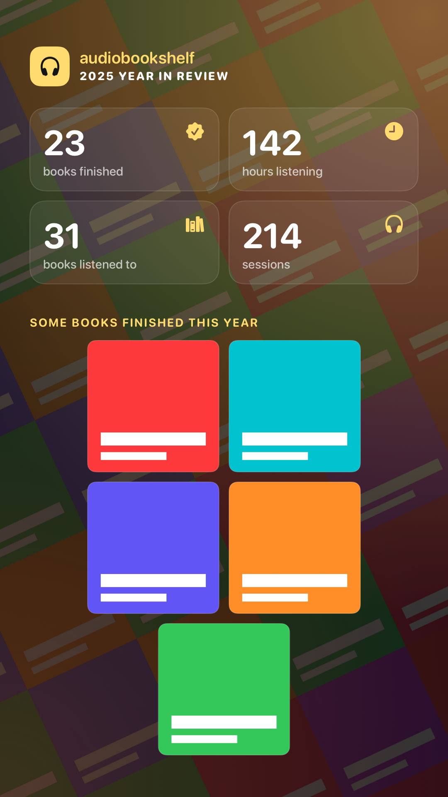
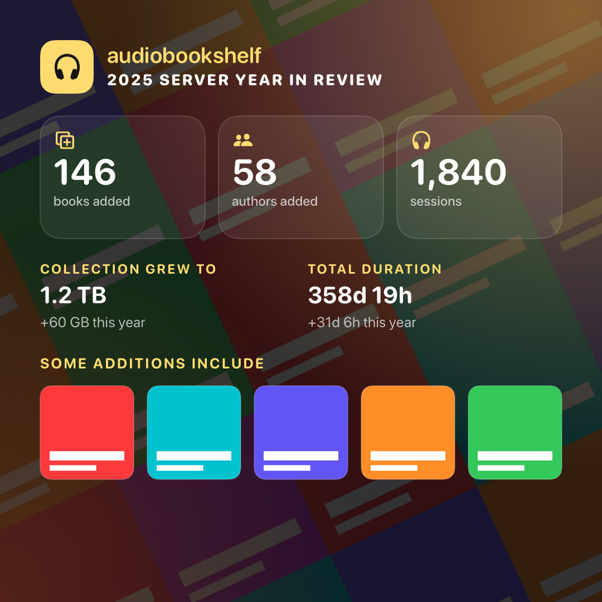

# Apple year-review image export

A native composer that turns one immutable annual snapshot into shareable images and a text summary,
generated entirely on the device. It lives in `apple/Export` and never calls the API itself: the app
loads stats and cover bytes and hands it a snapshot. `apple/App/YearReviewView.swift` does that loading.

## Legacy source and parity

The primary sources are the mobile canvases in `components/stats/` and the Audiobookshelf 2.30.0 server
(`server/utils/queries/userStats.js`, `adminStats.js`, `StatsController.middleware`).

| Legacy canvas | Native design | Notes |
| --- | --- | --- |
| `YearInReview.vue` variant 0 (stat boxes, top narrator/genre/author/month) | Highlights | Square and portrait. Portrait adds the longest finished book, which the endpoint already returns. |
| `YearInReview.vue` variant 1 (finished-book covers) | Finished | Square and portrait. Up to 5 `finishedBooksWithCovers`, center-cropped squares, under "Some books finished this year". Offered only when at least one finished cover loaded. |
| `YearInReview.vue` variant 2 (top authors and genres lists) | Top Lists | Square and portrait. Hidden when both lists are empty. |
| `YearInReviewShort.vue` (books finished/listened banner) | Compact | 3:1 banner, like the 600×200 original. |
| `YearInReview.vue` cover mosaic background | All listener designs | 5×5-style wall of finished then other covers, rotated -25° at 25% opacity under a scrim. Falls back to the gradient when no cover loaded. |
| `YearInReviewServer.vue` variant 0 (additions with covers) | Additions | Admin and root only. Books added, authors added, sessions, collection size and duration with this year's growth, up to 5 `booksAddedWithCovers`. Without covers it shows the library book count instead. |
| `YearInReviewServer.vue` variant 1 (top authors, top narrators) | People | Names only, as in the legacy canvas. Hidden when both lists are empty. |
| `YearInReviewServer.vue` variant 2 (top authors, top genres) | Genres | Names only. Hidden when there are no genres, so it never duplicates People. |

The server canvases share the server cover mosaic background. Sizes use binary units like `$bytesPretty`;
durations use days, hours and minutes like `$elapsedPrettyExtended`.
File names keep the legacy `audiobookshelf_my_<year>.png` / `_short.png` and `audiobookshelf_server_<year>.png`
schemes, plus `_finished`, `_top`, `_people`, `_genres` and `_story` suffixes.

## Contract

- `YearExportSnapshot(stats:year:artwork:locale:)` copies the values once and fails for years outside `2000...9999`
  (the same range `APIClient.yearListeningStats` accepts). Each snapshot has a fresh `id`.
- `YearExportComposer(snapshot:)` keys all of its state to `snapshot.id`. Passing a different snapshot
  rebuilds the composer, so a preview or share item from another year or account cannot survive.
  `YearExportSheet(snapshot:onDone:)` wraps it for modal presentation.
- `YearExportRenderer.render(_:layout:)` is a pure function from snapshot and layout to PNG bytes, the file name,
  the share text and an accessibility label. It uses `UIGraphicsImageRenderer` and Core Graphics, not SwiftUI
  `ImageRenderer` (iOS 16). Every API it uses is available on iOS 14.
- Sharing always re-renders when the cached preview is for another layout. It shares a PNG file plus the
  text summary through `UIActivityViewController`, anchored to the button for the iPad popover.
- Temporary file lifetime: each share writes into its own folder with complete file protection, owned by a
  `YearExportShareFile`. The folder is deleted in these cases:
  - Failed write: deleted at once, and the share falls back to an in-memory image.
  - Completion (shared, cancelled or dismissed): deleted by the completion handler, after the consumer has finished.
  - Share sheet released without a completion (for example parent teardown): deleted when the last holder lets go.
    The holders are the pending request in composer state and the share sheet's completion closure, so the file is
    never removed while the sheet can still hand it out.
  - Presentation: deferred out of the SwiftUI update. It is skipped if the request was superseded or the presenter
    was released. It fails, releasing the file, if the composer is detached from a window or already presenting.
  - Not covered: a process kill leaves the folder for the system's temporary-directory purge.
- Zero statistics render as zeros with a "No listening recorded" panel. Long names truncate with an
  ellipsis, and large numbers shrink to fit and then truncate. Durations are formatted as `Double`, never
  converted to `Int`, so finite values beyond `Int.max` (for example `1e100` seconds) cannot trap.

- Covers (`YearExportArtworkLoader.load`):
  - Takes the stats' own ID lists: listener `finishedBooksWithCovers` (primary, at most 5) and `booksWithCovers`
    (secondary, at most 25); server `booksAddedWithCovers` (secondary, at most 25). More IDs are never requested.
  - Refuses IDs that are not one safe path segment (`[A-Za-z0-9._-]`, not `.` or `..`) before any request.
  - `fetch` is the app's authenticated request. The app passes `APIClient.coverData(itemID:)`: the bearer token stays
    in the `Authorization` header (with refresh) and is never put in a `?token=` query, a file, the image or the text.
    `GET /api/items/:id/cover` requires a signed-in user; the IDs come from that same user's (or admin's) stats response.
  - At most 4 requests at once. A failed, missing or undecodable cover is skipped; the rest keep server order.
  - Decodes through ImageIO thumbnails capped at 512 px and 20 MB of input. Nothing is cached or written to disk.
  - Cancellation stops queueing, cancels in-flight fetches and throws `CancellationError`.
  - Account pinning: `currentAccount() == owner` is checked before every fetch, after every fetch (successful or
    failed) and at the end. The first mismatch, or a fetch throwing `accountChanged`, stops the whole load with
    `YearExportArtworkError.accountChanged`; it is never treated as a missing cover.
  - The app uses `YearExportArtworkLoader.load(year:primary:secondary:api:authorization:)`. Its owner is
    `APIClient.authorizationRevision` (the existing auth generation, new on every sign-in, sign-out and restore, not on
    token refresh), so a switch A, B, A still mismatches. Each request goes through
    `APIClient.coverData(itemID:authorization:)`, which refuses to send, and refuses a response or a 401 retry, once the
    revision has changed. No cover request is ever sent with a later session.
- Snapshots accept artwork only when its year and requested ID lists equal the stats they are built from.
  Artwork from another year, account load or response is dropped, leaving the gradient designs.
- `YearExportServerSnapshot(stats:year:artwork:locale:)` copies an admin `ServerYearStats` response. Totals are cleaned
  (non-finite or negative become 0) and byte counts clamp before `Int64` overflow, so `1e300` renders safely.
- `YearExportComposer(server:)` and `YearExportSheet(server:onDone:)` mirror the listener initialisers.

## Localized copy

The legacy canvases (`YearInReview.vue`, `YearInReviewShort.vue`, `YearInReviewServer.vue`) draw hard-coded English with
`addText('books finished', …)` and English `$bytesPretty` units; they use no `$strings` key. So the export's text has no
legacy translation of its own. A translation is shown only where `apple/Localization/legacy-equivalents.json` (owned by
the presentation worker) maps a template to a legacy key with the same meaning. Everything else stays English.

- `YearExportCopy(translations:locale:)` is an immutable value: translations keyed by the English templates in
  `YearExportCopy.templates`, plus the locale for numbers, month names, durations and sizes. `YearExportCopy.english`
  (the default) is English with `en_US`, independent of the device.
- It keeps only translations of known templates that are non-empty and use exactly the template's `90` placeholders, so
  a translation can neither drop a value nor show an argument that was never supplied. Arguments are filled in one pass,
  so names containing `{0}` are shown as written. Unknown keys are ignored. Cover IDs never reach any template.
- The snapshot keeps the copy (`YearExportSnapshot(stats:year:artwork:copy:)`, `YearExportServerSnapshot(stats:year:artwork:copy:)`).
  Images, share text, the accessibility label and the composer's own labels all read it from the snapshot, so a share
  keeps the language chosen when the snapshot was built even if the app language changes while the composer is open.
  The `locale:` initialisers remain for English text with another locale.
- Headings are drawn upper-cased with the copy's locale (`uppercased(with:)`), so templates are written in sentence case.
- Sizes follow `$bytesPretty` (base 1024, at most two decimals, `Bytes`/`KB`/`MB`/... symbols) with the locale's digits.
- Plurals use separate singular and plural templates, as the rest of the native app does.
- Not localized: the `audiobookshelf` wordmark, size unit symbols (as in legacy), file names, and the canvas layout,
  which stays left-to-right for Arabic and Hebrew (the composer chrome follows the app's layout direction).

Root call, once the presentation sources are registered in the app target:

```swift
let strings = NativeLanguageSetting.shared.strings          // or the view's @Environment(\.nativeStrings)
let copy = YearExportCopy(translations: strings.copy(YearExportCopy.templates), locale: strings.language.locale)
export = YearExportSnapshot(stats: value, year: year, copy: copy)
// covers: YearExportSnapshot(stats: stats, year: year, artwork: art, copy: copy)  (reuse the same copy)
// admin:  YearExportServerSnapshot(stats: server, year: year, artwork: art, copy: copy)
```

Build the copy once per load, next to the snapshot, and reuse it when covers upgrade the snapshot, so one load never mixes
languages. `apple/Localization/generate.py` already scans `apple/Export/Sources` for bare `copy("…")` calls; run it after
integration so the English table and `COVERAGE.md` include these templates. Its scanner finds exactly the
90 templates listed in `YearExportCopy.templates`.

Legacy equivalents today: `Finished` (style name) maps to `LabelFinished` and `Genres` to `LabelGenres` through existing
entries. `minutes listening` / `LabelStatsMinutesListening` ("Minutes Listening") and `minutes` / `LabelStatsMinutes`
("minutes") have the same meaning and could be added by the presentation worker. No other template has a legacy key with
the same meaning; `LabelYearReviewShow` ("See Year in Review") is a button, not the canvas heading.

Templates (90):

- `Share {0}`
- `Share Server {0}`
- `Done`
- `Style`
- `Format`
- `Share Image`
- `Creating image`
- `Opens the share sheet with this image and a text summary.`
- `The image is created on this device from your {0} statistics.`
- `The image is created on this device from this server's {0} statistics.`
- `Highlights`
- `Finished`
- `Top Lists`
- `Compact`
- `Additions`
- `People`
- `Genres`
- `Your totals with top narrator, genre, author and month.`
- `Your totals with covers of books you finished.`
- `Your totals with your top authors and genres.`
- `A short banner with your book counts.`
- `Server totals with covers of books added this year.`
- `Server totals with top authors and narrators.`
- `Server totals with top authors and genres.`
- `Square`
- `Story`
- `Banner`
- `{0}, {1} image`
- `My {0} in Audiobookshelf`
- `{0} hour of listening`
- `{0} hours of listening`
- `{0} minute of listening`
- `{0} minutes of listening`
- `{0} book finished`
- `{0} books finished`
- `{0} book listened to`
- `{0} books listened to`
- `{0} listening session`
- `{0} listening sessions`
- `Top author: {0}`
- `Top narrator: {0}`
- `Top genre: {0}`
- `Audiobookshelf server {0} in review`
- `{0} book added`
- `{0} books added`
- `{0} author added`
- `{0} authors added`
- `Collection: {0} (+{1} this year)`
- `Total duration: {0} (+{1} this year)`
- `{0} year in review`
- `{0} server year in review`
- `book finished`
- `books finished`
- `book listened to`
- `books listened to`
- `session`
- `sessions`
- `hour listening`
- `hours listening`
- `minute listening`
- `minutes listening`
- `Time listening`
- `hour`
- `hours`
- `minute`
- `minutes`
- `Top narrator`
- `Top genre`
- `Top author`
- `Top month`
- `Longest book finished`
- `Top authors`
- `Top genres`
- `Top narrators`
- `Some books finished this year`
- `No listening recorded in {0}`
- `Press play and your year will fill in here.`
- `book added`
- `books added`
- `author added`
- `authors added`
- `In your library`
- `{0} book`
- `{0} books`
- `{0} listened this year`
- `Some additions include`
- `Collection grew to`
- `Total duration`
- `+{0} this year`
- `{0} days`

## Model types for root wiring

All in `tvos/Core` (TVCore) unless noted:

- `YearListeningStats.finishedBooksWithCovers: [String]`, `.booksWithCovers: [String]` (default `[]` for older servers).
- `ServerYearStats` (Decodable, Sendable): `numListeningSessions`, `numBooksAdded`, `numAuthorsAdded`, `numBooks`,
  `totalBooksAddedSize`, `totalBooksAddedDuration`, `totalBooksSize`, `totalBooksDuration`, `totalListeningTime`
  (null or missing totals decode as 0), `booksAddedWithCovers`, `topAuthors`, `topNarrators`, `topGenres`.
- `APIClient.serverYearStats(_ year: Int)` calls `GET api/stats/year/<year>` and rejects years outside `2000...9999`
  without a request. A non-admin gets `APIError.http(403)` from the server.
- `CurrentUser.canViewServerYearStats` is true for `root` and `admin` only.
- `APIClient.authorizationRevision: UUID` (read-only view of the existing `authGeneration`; auth mutation is unchanged)
  and `APIClient.coverData(itemID:authorization:)` (the cover request pinned to that revision).
- `YearExport` module: `YearExportArtwork`, `YearExportArtworkLoader`, `YearExportArtworkError`,
  `YearExportSnapshot(stats:year:artwork:locale:)`, `YearExportServerSnapshot`, `YearExportComposer`, `YearExportSheet`.

## Root integration

`apple/App/YearReviewView.swift` is wired in this branch:

- The store reads `authorizationRevision` before requesting stats and accepts them only if it is unchanged afterwards
  (plus the existing account check). It builds a cover-less `YearExportSnapshot`, then a stored, cancellable task loads
  covers pinned to that revision and replaces the snapshot only if the request and revision still match.
- For `canViewServerYearStats` accounts it then loads the server year. Each step (`me`, server year, server covers)
  re-checks the same request and revision, so a sign-in change at any point, even back to the same account, ends the
  sequence. A 403 or network error leaves the server share hidden.
- `load(year:)` and `invalidate()` cancel that task and clear both snapshots.
- The share button (a menu with "Share My Year" and "Share Server Year" for admins) captures the snapshot when tapped and
  presents one `.sheet(item:)`. Covers arriving later never change an open composer.

The integrated app registers `Export/Sources/YearExport` in `apple/project.yml` and its generated project, and declares
`NSPhotoLibraryAddUsageDescription`. Physical Save Image and iPad share presentation remain acceptance gates.

The coordinator reran the reviewed, integrated branch after merging Apple TV completion:

- 24 Export tests passed on the dedicated year-export simulator.
- 27 shared TVCore tests passed, including pinned-cover account switching.
- All native app, shared playback, core and export sources typechecked for iOS 14.
- The actual `AudiobookshelfNative` simulator target built successfully on Xcode 27 (15.0 build-only override).
- Local logs: `/tmp/abs-year-final-export.log`, `/tmp/abs-year-final-core.log`, `/tmp/abs-year-final-minimum.log`,
  `/tmp/abs-year-final-build.log`.

Synthetic examples, rendered with no owner data:




## Verification

- `cd apple/Export && xcodebuild test -scheme YearExport -destination 'platform=iOS Simulator,name=Audiobookshelf Year Export QA'`
  runs eight renderer and model tests. They were written first and observed failing against a stub: 7 of 8 failed
  (25 assertions), and the long-text overflow guard passed trivially on the blank stub. All 8 pass now. The tests
  decode the PNG and check pixel size and drawn text pixels for every layout, that pixels change with the data, that
  snapshot identity, year, file name and share text match, year validation, empty-year layouts, layout validation, that
  sharing never reuses a preview for another layout, and that very long names stay bounded.
- Review fixes on top of `6463c23c`, also red first:
  - `testFiniteButEnormousDurationsRenderAndShareWithoutTrapping` crashed the test process with
    "Double value cannot be converted to Int because the result would be greater than Int.max" before the fix.
  - `YearExportShareTests` failed in 3 of 4 cases against the original share behaviour, moved unchanged behind the
    testable seams: failed-write cleanup, release without completion, and presenting from a detached composer.
    Completion cleanup already worked and passed.
  - A mutation check (removing `deinit`) makes the release and detached-presentation tests fail again.
  - All 13 tests pass.
- A throwaway XCUITest host outside the repository drove the composer on a dedicated "Audiobookshelf Year Export QA"
  simulator (iPhone 17, iOS 27) with synthetic data only. It covered switching style and format, presenting the share
  sheet (it showed `audiobookshelf_my_2025_short` as a PNG image) and the empty year hiding Top Lists. Screenshots stay local.
- Annual covers and server export, red first: `YearExportArtworkTests` (9 tests) against stubs failed 8 of 9, with an
  "Index out of range" crash in the loader-order test; the identifier-leak guard passed trivially on the blank stub.
  `AnnualStatsTests` in TVCore (4 tests) failed 4 of 4 before the decode, route and role gate existed. Now all 22 Export
  tests and all 19 TVCore tests pass. They cover server order and unsafe, failed and undecodable covers, the 5 and 25
  caps, cancellation (no artwork, no more than 4 started fetches), account change, rejecting artwork for another
  year or other covers, covers actually drawn (pixel colour) in the mosaic and Finished designs, no cover ID in the PNG,
  text or accessibility label, the server designs, file names, sizes and text, hiding unfillable server lists, and
  `1e300` totals.
- Pinning review fix on top of `dfd9bfdc`, red first against the shipped wiring (the new glue started as a stub doing
  exactly what `YearReviewView` did: `currentAccount()` owner and unpinned `coverData`):
  - `YearExportPinnedArtworkTests.testAccountSwitchAToBToAWhileCoversLoadAbortsWithoutRequestingUnderAnotherSession`
    drives the real `APIClient` through a gated URL protocol: alice's first batch of 4 is held, bob signs in, those
    covers fail with 404, alice signs in again. Before the fix covers `s4` and `s5` were requested with bob's token and
    the load ended with `CancellationError`; now it ends with `accountChanged` and no request carries another session.
  - `testAnAccountChangeReportedByAFetchIsNotTreatedAsAMissingCover` returned 1 cover before the fix.
  - TVCore `PinnedCoverTests` sent `li-2` with bob's token and `li-3` with alice's new token before the fix; now only
    the request made under the pinned revision is sent.
  - Now 24 Export tests and 20 TVCore tests pass; the pinned tests also passed 20 repeated iterations. The scratch app
    build with the wired view succeeds.
- Synthetic-cover renders of every listener and server layout were inspected locally (`/tmp/yearexport-evidence/covers`,
  not committed). That pass found and fixed a mosaic drawn at full opacity and a divider drawn in copy blend mode.
- Localized copy, red first: `YearExportCopyTests` (4 tests) failed 4 of 4 (147 assertions) against a stub that ignored
  translations: an empty template list, English share lines, labels and composer text, identical PNGs, German digits
  missing, and placeholder checks. All 28 Export tests pass now. A read-only run of the presentation generator's scanner
  over `apple/Export/Sources` finds exactly the 90 listed templates. A German sample with the real legacy translations
  (`/tmp/yearexport-evidence/copy`, not committed) drew "Gehörte Minuten", "Minuten" and `1.214`. Abbreviated durations
  stayed `25min` in the test host, which has no German localization; whether the app bundle localizes them is unverified.
- Not verified: a live server. Loading covers and the admin year from a real account is an owner-data operation and
  needs root review first; nothing here contacted a server. Also not verified: an iOS 14 or 15 runtime (none is installed), the iPad popover on a device, saving to Photos, and physical devices.
  All physical acceptance and migration gates remain open.
