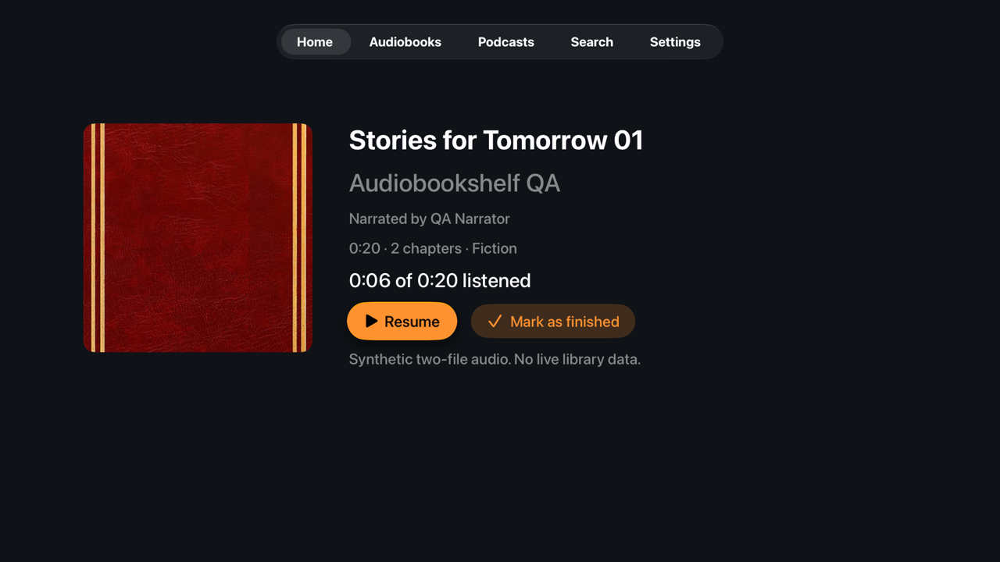
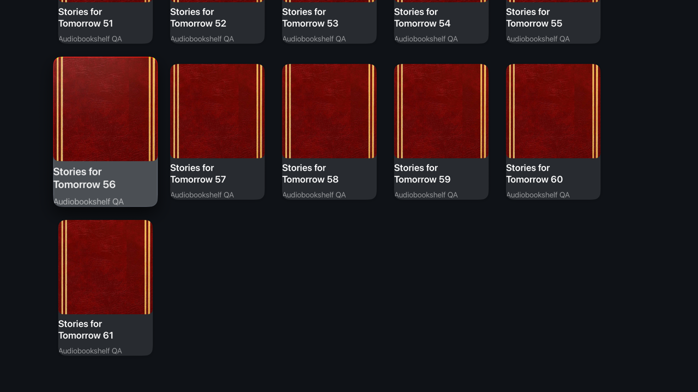
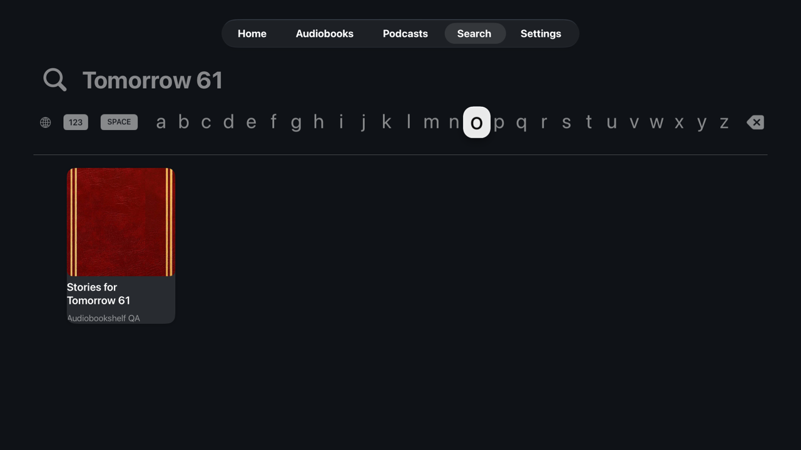
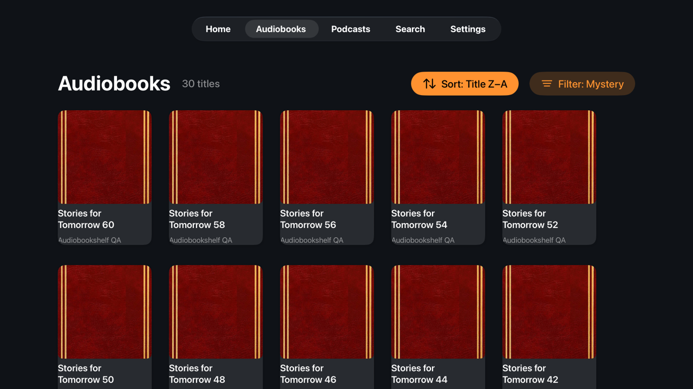
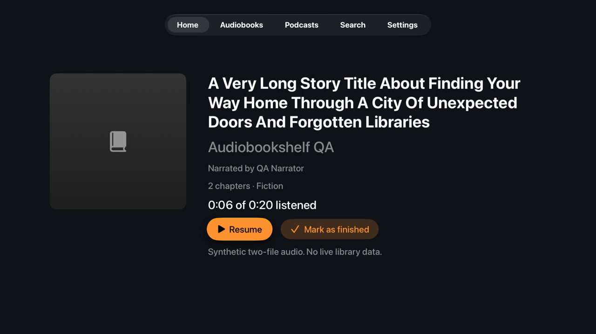
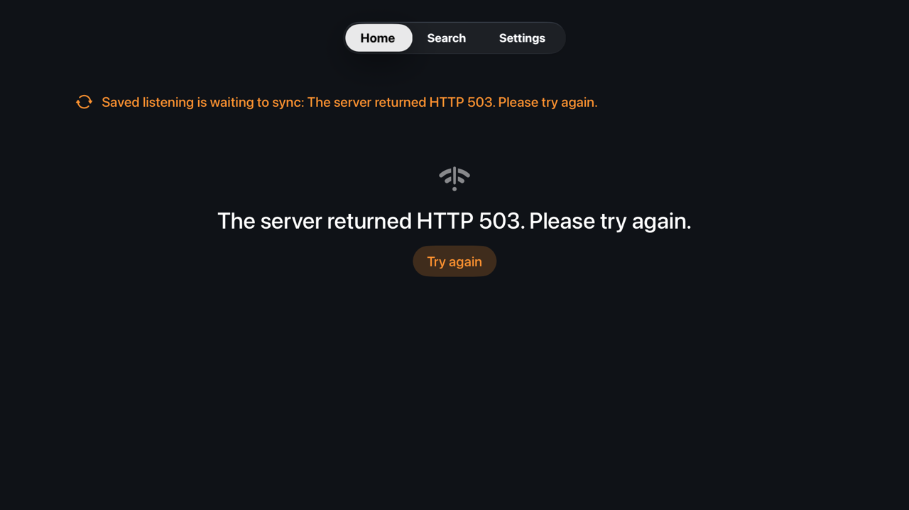
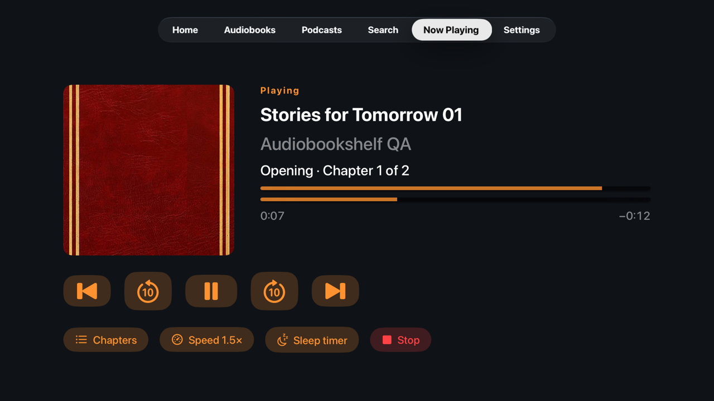
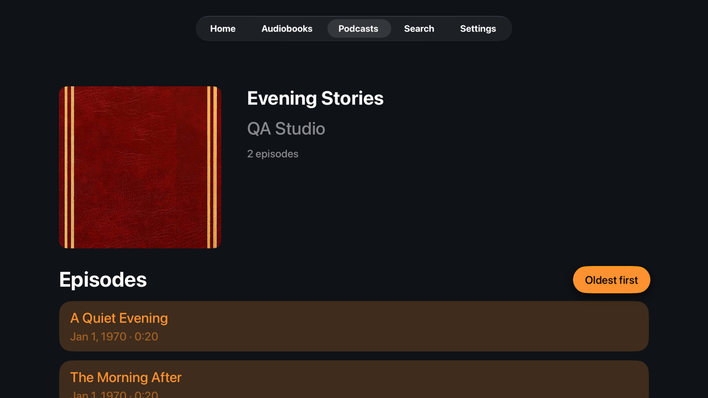
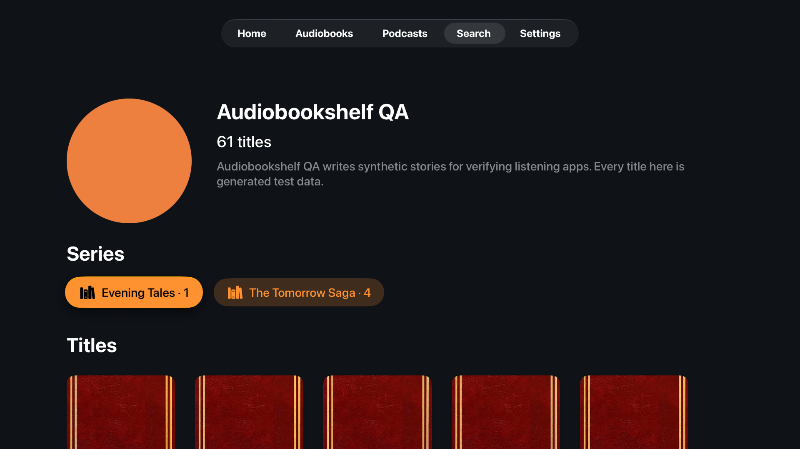
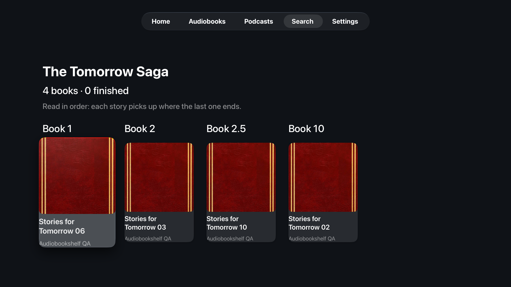

# Apple TV verification

Last verified October 2, 2026, on `feat/related-author-series` (story #21) over the integrated base `ed3463d5`, on the Studio with Xcode 27.0 (27A266a), the tvOS 27 simulator `Audiobookshelf TV QA` (`00DD108F-2435-4FEC-9C37-3E62861A0EF6`, Apple TV 4K 2nd generation, 1080p) and the synthetic fixture `verification/fixture.py`, which reports server version `2.30.0-fixture`, extended with the 2.30 author and series routes by `tvos/scripts/related_fixture.py`. Fixture titles, accounts and audio are synthetic; no live library or credentials were used.

## Automated evidence

Coordinator integration reran the complete suite from `feat/apple-tv-completion` on October 2: 22 core tests, 11 app unit tests and 16 remote journeys passed. The run includes the shared playback changes already merged for cellular preferences. Local result: `tvos/build/TVJourneys-20261002-012452.xcresult`; the generic tvOS simulator build also passed.

| Check | Command | Result |
| --- | --- | --- |
| TV core contracts | `swift test --package-path tvos/Core` | 41 passed |
| TV app unit tests (`TVAppTests`) | run by `./tvos/scripts/verify-ui.sh` | 12 passed |
| Remote-driven journeys | `./tvos/scripts/verify-ui.sh` | 20 journeys passed, 0 failed (543 s); local result `tvos/build/TVFull-related-final.xcresult`. After the final details-links and spacing change to the related views only, `TVAppTests` and `RelatedJourney` passed again: 16 of 16 (`tvos/build/Related-final.xcresult`) |
| Signed device build and install | `./tvos/scripts/deploy.sh --no-launch a5ef39a5001ef59dec9c2fa15838447215252137` | Release build signed by team `C7X9BCC7LP`, `codesign --verify --deep --strict` passes, installed on Living Room TV (tvOS 18.6) |

The journeys run the Debug app with no test-only code paths beyond the launch-time reset. They operate it only through `XCUIRemote` presses (directions, Select, Menu, Play/Pause) and keyboard entry. They then assert what the screen shows and what the fixture server observed. Every journey was written first. The red run on October 1, 2026 against the previous TV app failed all 13 journeys before any implementation.

| Story | Journey | Proves |
| --- | --- | --- |
| #26 | `CatalogJourney.testContinueListeningOpensDetailsAndBackRestoresFocus` | Home shelf → details with narrator and server progress → Back returns focus to the same tile |
| #26 | `CatalogJourney.testLibraryLoadsNextPageAsFocusMovesDown` | Moving down loads page 2 (61st title) with no Load more button; server saw pages 0 and 1 |
| #26 | `CatalogJourney.testServerSearchFindsTitlesOutsideLoadedPage` | Search keyboard → server search → a title outside the first page → details |
| #26 | `CatalogJourney.testFilterAndSortAreAppliedByTheServer` | Genre filter and Z–A sort are applied by the server through the menus |
| #26, #28 | `CatalogJourney.testCatalogFailureRecoversWithRetry` | Server outage shows a recovery message; Try again recovers after the server returns |
| #26 | `CatalogJourney.testTrustedHTTPSServerAndLongMetadata` | HTTPS through a CA trusted by the device only, reverse-proxy path, very long title, missing cover placeholder, supported sign-in explanation |
| #27 | `PlaybackJourney.testResumeShowsChapterAndTotalProgressAndRemoteToggles` | Resume at server position, chapter title/number, remote Play/Pause pauses and resumes the same session |
| #27 | `PlaybackJourney.testNextChapterCrossesFilesAndLeavingThePlayerKeepsPlaying` | Chapter list seek into the second audio file; leaving Now Playing for Home keeps listening |
| #27 | `PlaybackJourney.testSpeedSelectionAndExplicitStopClosesTheSession` | Speed menu; Stop closes the server session |
| #27 | `PlaybackJourney.testNaturalEndShowsFinished` | Multi-file book plays to its natural end and reports Finished at 0:20 |
| #28 | `RecoveryJourney.testMediaFailureOffersRestartRatherThanSavingProgress` | Unplayable audio shows Restart playback, not Save progress again; after the server recovers, Restart reaches Playing on the same title without leaving Now Playing |
| #28 | `RecoveryJourney.testUnsentListeningSurvivesTerminationAndSyncsOnRelaunch` | With the server rejecting progress, listen, pause and terminate. Relaunch sends the saved listening once; details show the new server position; a second relaunch sends nothing more |
| #29 | `PodcastJourney.testEpisodesSortAndPlaySeparatelyFromBooks` | Newest/oldest episode order, episode details, playback, server listening recorded for the episode only |
| #29 | `PodcastJourney.testMarkEpisodeFinishedUpdatesOnlyThatEpisode` | Mark as finished sends `PATCH /api/me/progress/podcast/episode-morning`; only that episode shows Finished |
| #29 | `PodcastJourney.testPodcastResultTileShowsItsEpisodeProgress` | A finished episode's search tile reports Finished, from that episode's progress rather than the podcast's |
| #21 | `RelatedJourney.testSearchOpensAuthorWithBioSeriesAndEveryBook` | Search → author with server image, bio, 61-title count and both series; moving down loads the second page; the server saw `/api/authors/author`, the `authors.<base64>` items filter on page 1 and the author series request |
| #21 | `RelatedJourney.testSeriesFollowsServerSequenceAndOpensTheIntendedBook` | Search → series with description and finished count from `include=progress`; books in server sequence order labelled Book 1, 2, 2.5, 10 (not title or text order); Book 2.5 opens its own details |
| #21 | `RelatedJourney.testBookDetailsLeadToItsSeriesAndAuthor` | Details read "The Tomorrow Saga, book 2" and open the series, then the author; Back returns to the details |
| #21 | `RelatedJourney.testSeriesFailureRecoversWithRetry` | A failed series request shows the recovery message; Try again loads it |
| #26, #28 | `CatalogJourney.testProgressFilterDropsATitleMarkedFinishedOnReturn` | With the Not started filter, marking a title finished and pressing Back refetches the filter so the title is gone and the filter is kept |

`TVAppTests` covers what the fixture cannot produce: formatting of absurd server times (for example `1e300` seconds) saturates instead of trapping, search keeps a podcast and each of its matching episodes as separate navigable results, only an HTTP 404 marks a cover as absent (5xx, 429, timeouts and cancellations retry), and Restart playback holds back while its item fetch is pending if a newer session for the same media, a pause, a recovering seek, any newer play/pause/seek request (the shared playback intent revision) or a sign-out happens meanwhile, without showing the stale attempt's error. `MediaRestartTests` failed first against the earlier ID-only check: it restarted the newer session, overrode the pause and the recovery, ignored the account switch and published the old failure; the intent-revision case failed before the restart pinned `playbackIntentID`. Each of those tests and the new journeys failed first on October 1–2, 2026. The media-failure journey failed because Now Playing offered Save progress again; it then exposed two more TV defects that are now fixed: the error row was unreachable with the remote, and restarting dropped back to Home while the new session prepared. Other first failures: the formatting test crashed with `Double value cannot be converted to Int`, search returned one result instead of three, the cover policy cached 500/503/429, the filter kept the finished title, and the tile reported no progress.

`RelatedJourney` failed all 4 journeys on October 2, 2026 before story #21 was implemented: search showed no author or series and details had no series link. Details of the core and app tests are in [APPLE-RELATED-AUTHOR-SERIES.md](../docs/modernization/APPLE-RELATED-AUTHOR-SERIES.md).

Screenshots captured by those journeys:

## Remaining physical-TV acceptance

Installing the build is not acceptance. These checks need a person using the Siri Remote on the paired Living Room TV, against the real server (2.30.0) over the trusted homelab CA. None of them has been performed for this build:

1. Sign in with the remote; confirm the HTTPS connection, and confirm that a wrong password or an unreachable address shows the recovery text.
2. Across-room readability: titles, focus highlight, progress bars and the Now Playing timeline from the sofa; long real titles and missing covers.
3. Browse Home, each library (sort, filter, scroll a large library to its end), Search and details; Back from every screen returns to the expected focus.
4. Audiobook playback of real codecs (for example m4b/mp3) including a multi-file book: file transitions, rapid skips, chapter list and previous/next chapter, speed changes, natural end.
5. System controls: the Siri Remote Play/Pause on other tabs, the TV Control Center Now Playing card, and any AirPlay/HomePod route change act on the same session.
6. Podcast episode chosen with the remote plays real audio; the server shows that episode's progress only.
7. Durability on hardware: listen, force-quit from the app switcher, relaunch, then confirm server progress and resume on the iPhone without double-counted listening time. Repeat with the network disconnected while listening, then reconnected.
8. Leaving with the TV/Home button pauses and saves; the screen saver and Control Center keep listening.
9. Login expiry: after server-side token revocation, the TV asks for the password and then sends the saved listening.
10. Authors and series against the real server: an author with and without an image, a series with decimal and missing sequences, an author with more than 60 titles; remote focus through the related search row, the author's series row and title grid, and Back.

These behaviours have no automated test yet and rely on the physical checks above or on review: rapid skips across file boundaries (check 4), login expiry (check 9), and Home/Search when one of several libraries fails. The synthetic fixture has no mode that fails a single library or revokes a token.

See [HANDOFF.md](HANDOFF.md) for the hardware storage caveat that affects check 7.
