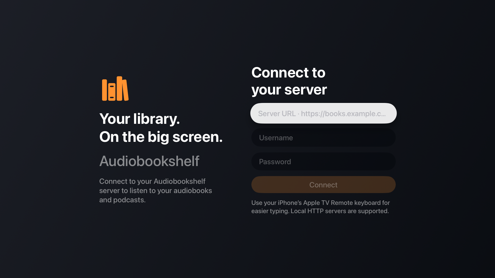
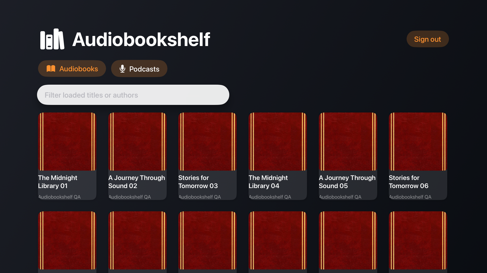
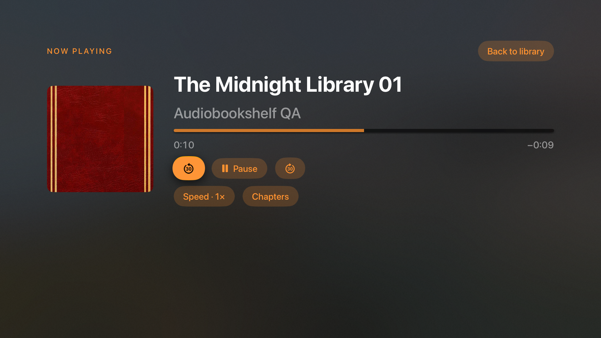

# Apple TV build verification

Verified September 30, 2026 on this Mac.

- Release build against the Apple TV hardware SDK succeeds with the installed Apple Development certificate and a tvOS development provisioning profile.
- Strict deep code-signature verification succeeds. The application declares platform `AppleTVOS`, device family `3`, and minimum tvOS version `17.0`.
- Nine Swift core checks pass. They were written and observed failing before implementation, including an additional failing regression check before the expired-audio-token fix.
- A second-generation Apple TV 4K simulator with tvOS 27 runs the app and renders the sign-in screen.
- A separate temporary smoke application uses the production `APIClient`, `LibraryStore`, Keychain store, `TVPlayer`, and SwiftUI views against an isolated local HTTP fixture. No fixture accounts or automation hooks are compiled into the production app.
- Runtime smoke passes for password sign-in, 401 token refresh, reverse-proxy subpaths, paginating 60 + 1 titles, saving refreshed credentials in Keychain, loading full item details, authenticated audio streaming, resume at six seconds, natural transition between two WAV files, backward seeking across the file boundary, 1.5× speed, pause, session sync/close, podcast episode playback, and Keychain removal on sign-out.
- Captured server reports confirm that listening time is sent as a delta and that both audiobook and podcast sessions are closed.
- Installer shell syntax passes; without a paired physical Apple TV, it exits before changing provisioning or attempting installation and explains the pairing step.

Simulator evidence uses synthetic titles and audio, not the user's library:

Limits of verification: physical installation and launch were verified on October 1, 2026, but physical-TV remote interaction has not been exercised by automation. The simulator smoke drives production methods directly; remote focus behavior was visually inspected, not exercised by an automated remote. The live Audiobookshelf server, production media codecs, and connection-loss recovery still need a device acceptance check. The installer registered and provisioned the actual paired TV before the successful install; the original pre-pairing IPA should not be used for that device.
